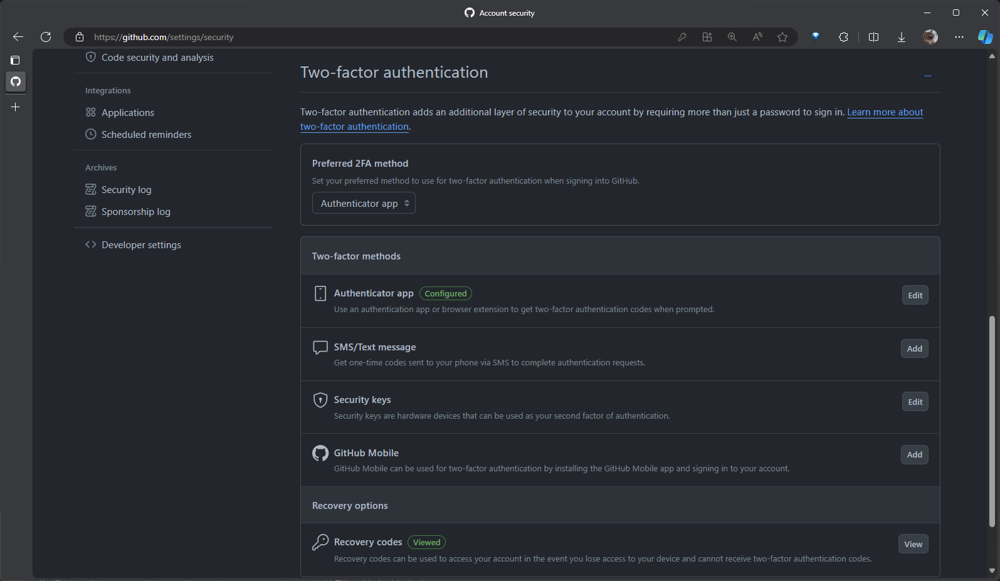
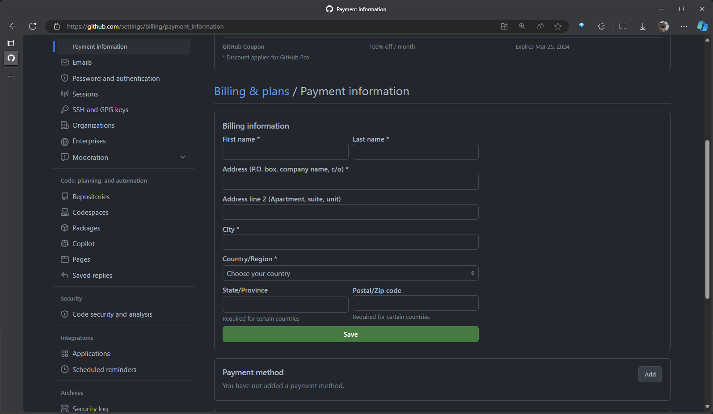
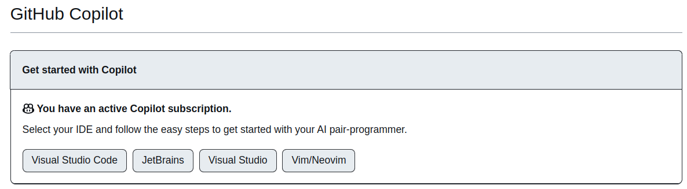

# Install Copilot for Neovim

## Get Github student benefits

1. Enable 2FA
   
   Go to https://github.com/settings/security
   

2. Fill out Billing information
   
   Go to https://github.com/settings/billing/payment_information

   Only need to fill out the payment information, credit card is not required.

   

3. Fill out the Benefits Application
   
   Go to https://education.github.com/discount_requests/application

   If your default email is not your school email, you need to add your school email to your github account.

   

4. Download The Certificate of Enrollment (在學證明單) and upload it.
   
   Log in Portal (單一入口) and enter Grading System (學籍成績管理系統) and Download.

   The file format should be jpg.

   Use `choose file` to upload it.

   Finally, click `Process my application` to continue.

5. Verify your application
   
   Go back to https://education.github.com/discount_requests/application

   You will see the status of your application.

   

6. Verify your Github Copilot subscription.

   Go to https://github.com/settings/copilot

   You will see the status of your subscription.

   

## Install Neovim

```
sudo add-apt-repository ppa:neovim-ppa/stable
sudo apt update -y
sudo apt install neovim
```
See https://unixcop.com/how-to-install-neovim-on-ubuntu-20-04-22-04-lts/

## Install Node.js
See https://www.digitalocean.com/community/tutorials/how-to-install-node-js-on-ubuntu-20-04
install with option 3 — Installing Node Using the Node Version Manager 

We need newest version of nvm
```
curl -o- https://raw.githubusercontent.com/nvm-sh/nvm/v0.39.3/install.sh
curl -o- https://raw.githubusercontent.com/nvm-sh/nvm/v0.39.3/install.sh | bash
source ~/.bashrc
nvm list-remote
nvm install v18.19.1
```
Substitute the nvm version if newer version is released

## Copilot

Now we are ready to install Copilot
https://docs.github.com/en/copilot/getting-started-with-github-copilot/getting-started-with-github-copilot-in-neovim?platform=linux

```
git clone https://github.com/github/copilot.vim \
   ~/.config/nvim/pack/github/start/copilot.vim
```

Use neovim
```
nvim
```
In navigation mode
```
:Copilot setup
```
```
:Copilot enable
```
You will be asked to add code to enable the device.

You will see this


## Get Started

```
nvim [your python file].py
```

* Create docstring for a class 
```
class Point:
   """
   Auto-complete for the docstring will appear here; tab to confirm
   """
```

* Create code from comment
```
# Create a point at the origin
origin = Point() # this will appear automatically

# Create a point at 3, 4
point = Point()   # keep press tab and enter
point.x = 3.0     # keep press tab and enter
point.y = 4.0     # keep press tab and enter

```

# Install NeoVim Plugins

```
curl -fLo ~/.local/share/nvim/site/autoload/plug.vim --create-dirs     https://raw.githubusercontent.com/junegunn/vim-plug/master/plug.vim
```

Edit the init.vim
```
nvim ~/.config/nvim/init.vim
```

Add the plugin to it
```
call plug#begin('~/.local/share/nvim/site/plugged')
Plug 'junegunn/goyo.vim'
Plug 'vim-airline/vim-airline'
Plug 'vim-airline/vim-airline-themes'
Plug 'flazz/vim-colorschemes'
Plug 'mhinz/vim-startify'
Plug 'ap/vim-css-color'
Plug 'junegunn/fzf', { 'do': { -> fzf#install() } }
Plug 'junegunn/fzf.vim'
Plug 'spf13/vim-autoclose'
Plug 'ryanoasis/vim-devicons'
Plug 'preservim/nerdtree'
Plug 'itchyny/lightline.vim'
Plug 'preservim/nerdcommenter'
Plug 'majutsushi/tagbar'
call plug#end()

set number

" Airline configuration
let g:airline#extensions#tabline#enabled = 1
let g:airline#extensions#tabline#formatter = 'default'

" Nerdtree configuration
map <C-n> :NERDTreeToggle<CR>
let NERDTreeIgnore=['\.pyc$', '\~$']
" autocmd VimEnter * NERDTree
autocmd VimEnter * wincmd p
let g:NERDTreeDirArrowExpandable = '▸'
let g:NERDTreeDirArrowCollapsible = '▾'

" Switching between buffers
" Set commands to switching between buffers
:nnoremap <Tab> :bnext!<CR>
:nnoremap <S-Tab> :bprevious!<CR>
:nnoremap <C-X> :bp<bar>sp<bar>bn<bar>bd<CR>

nmap <F8> :TagbarToggle<CR>
autocmd vimEnter *.py nmap <F9> <Esc>:w<CR>:!clear;python3 %<CR>
autocmd vimEnter *.cpp map <F9> :w <CR> :!clear ; g++ --std=c++17 %; if [ -f a.out ]; then time ./a.out; rm a.out; fi <CR>
:vnoremap <f10> :!python3<CR>
```

In neovim, call InstallPlugin to install
```
nvim
:PlugInstall
```

# Install NeoVim Tagbar Plugins

Ubuntu 20.04 run the following command to install the required packages

```
sudo apt install libncurses5-dev \
libgtk2.0-dev libatk1.0-dev \
libcairo2-dev libx11-dev libxpm-dev libxt-dev python-dev \
python3-dev git ctags ripgrep
```

Ubuntu 22.04 run the following command to install the required packages

```
sudo apt install libncurses5-dev \
libgtk2.0-dev libatk1.0-dev \
libcairo2-dev libx11-dev libxpm-dev libxt-dev python-dev-is-python3 \
python3-dev git universal-ctags ripgrep
```

Try it out:
* Ctrl + n -> 左邊出現檔案管理
* F8 -> 出現function list
* :Rg -> 全文檢索搜尋，例如 class XXX, def YYY, 在專案裡都可以找
