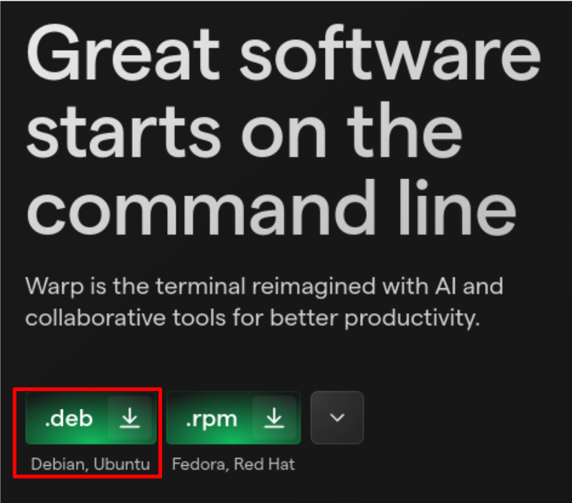
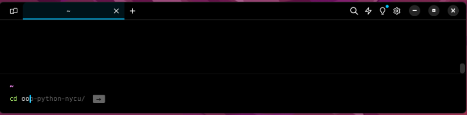
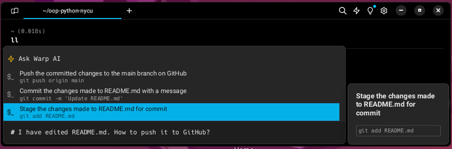

# Warp Terminal

### What is Warp?

Warp is a modern, Rust-based terminal with AI built in so you and your team can build great software faster

[Official Website](https://www.warp.dev/)

[User Manual](https://docs.warp.dev/)

## Install warp

1. Download the latest version of Warp from the official website

    Visit the [Official Website](https://www.warp.dev/) and download the latest `.deb` version of Warp for your system.
    

2. Install the downloaded package

    Run the following command to install the downloaded package:
    Don't forget to replace `<file>` with the name of the downloaded package.

    ```bash
    sudo apt install ./<file>.deb
    ```

    For example, my downloaded package is `warp-terminal_0.2024.02.27.08.01.stable.03_amd64.deb` and it is located in the `Downloads` directory. So, I will run the following command:

    ```bash
    sudo apt install ./Downloads/warp-terminal_0.2024.02.27.08.01.stable.03_amd64.deb
    ```

3. Start Warp
    
    When the first time you start Warp, you will be asked to sign up/in to your Warp account. You can sign up using your Github or Google account.

    

    After signing up, you can start using Warp.

    You can type any command in the terminal like you do in any other terminal.
    Warp will automatically detect the command and provide you with suggestions.
    You can use the `Right Arrow` key to accept the suggestion.

    

    Also, you can press `` ctrl+` ``  or type `#` for AI command suggestions.

    