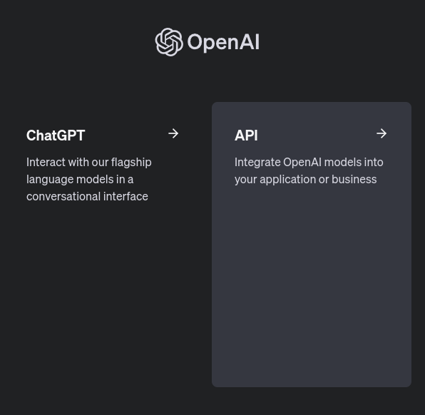
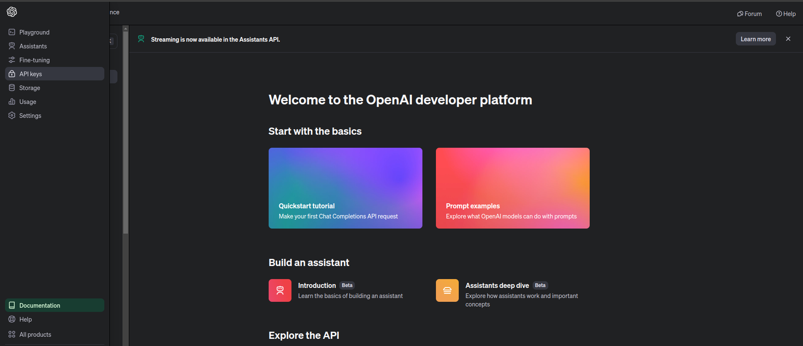
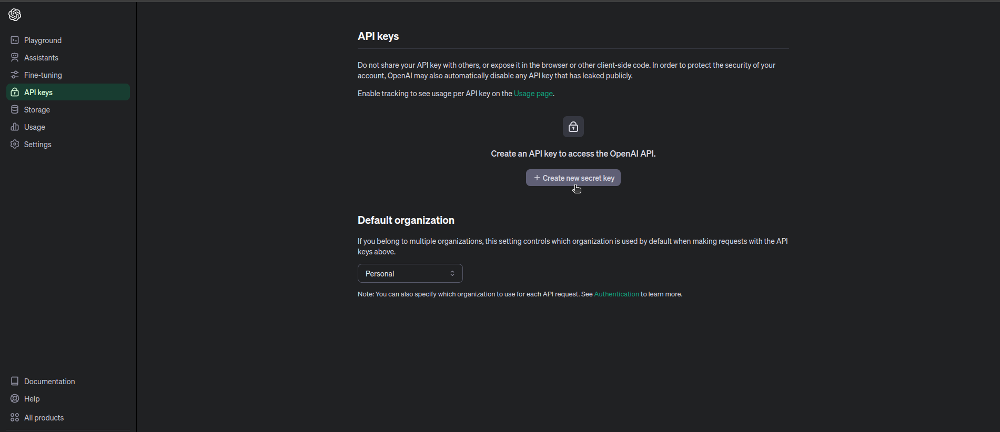
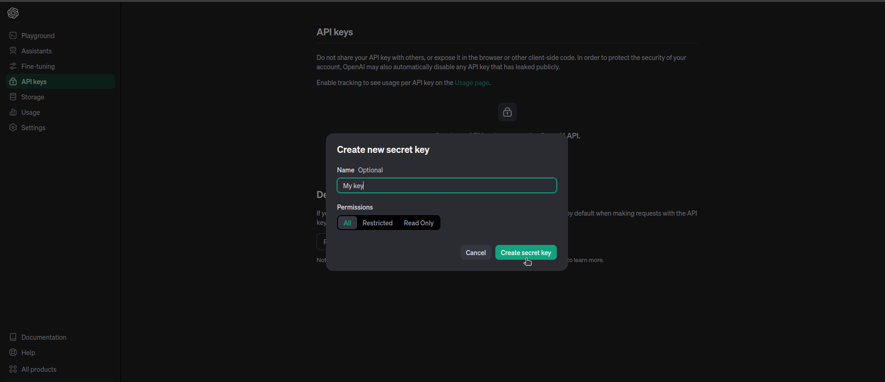
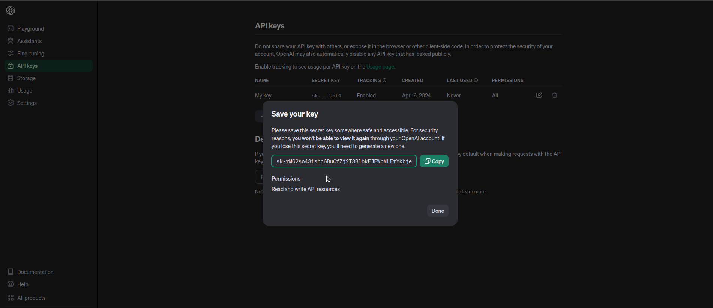
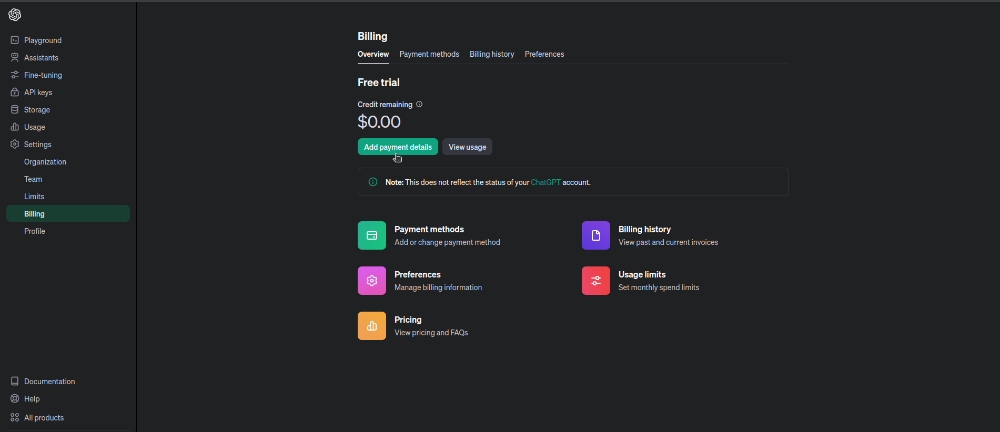
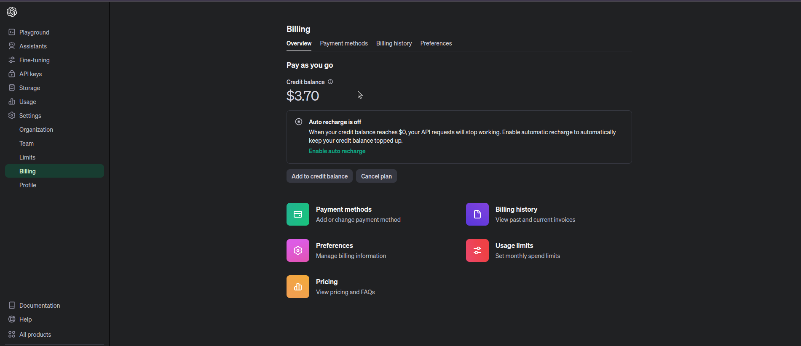

# Quickstart for OpenAI Python API

This quickstart is based on [Quickstart tutorial - OpenAI API](https://platform.openai.com/docs/quickstart)
## 1. Create an OpenAI API key

### 1. Visit [OpenAI website](https://openai.com/) and login to your account.

### 2. After logging in, OpenAI will redirect you to the [apps website](https://platform.openai.com/apps). Click on the API to go API overview page.



### 3. In the API overview page, click on the `API keys` tab.



### 4. Click on the `Create new secret key` button.



### 5. Give a name to your API key and click on the `Create` button.



### 6. Copy the API key and save it in `~/.bashrc`.

一定要在這步將 key 複製到剪貼簿

> [!IMPORTANT]
> Please save this secret key somewhere safe and accessible. For security reasons, you won't be able to view it again through your OpenAI account. If you lose this secret key, you'll need to generate a new one.
> 
> 請將此密鑰儲存於安全且可訪問的地方。出於安全原因，您將無法透過您的 OpenAI 帳戶再次查看此密鑰。如果您遺失了這個密鑰，您將需要生成一個新的密鑰。

> [!CAUTION]
> 請立刻將key複製到剪貼簿，因為您將無法再次查看此 key。



Set the environment variable `OPENAI_API_KEY` to the API key in your `~/.bashrc`.

Run this in terminal to edit the `~/.bashrc` file.

```bash
nvim ~/.bashrc
```

Add the following line to the end of the file.

```bash
export OPENAI_API_KEY='your-api-key-here'
```

> [!NOTE] 
> Replace `your-api-key-here` with the API key you copied in the previous step.
> 
> If you forget to copy the key, you should go back to 4. and copy the key.

After adding the line, save and exit the file.

### 8. Source the `~/.bashrc` file to apply the changes.

```bash
source ~/.bashrc
```

Check if the environment variable is set correctly.

```bash
echo $OPENAI_API_KEY
```

### 9. Setup billing information
Go to `Settings` -> `Billing` -> `Add payment details` and choose `Individual`.



After setting up the billing information, you will see the credit balance. And you can start using the OpenAI API.



## 2. Test the OpenAI API key
### 1. Check openai version

```bash
pip3 list | grep openai
```

### 2. Test the OpenAI API key in Python

Tested on 
`openai==1.19.0 or 1.5.0`

You can use this Python code to test the API key.

```python
from openai import OpenAI
client = OpenAI()

completion = client.chat.completions.create(
  model="gpt-3.5-turbo",
  messages=[
    {"role": "user", "content": "Hello world"}
  ]
)

print(completion.choices[0].message)
```

Tested on
`openai==0.28.1`

You can use this Python code to test the API key.

```python
import openai
completion = openai.ChatCompletion.create(model="gpt-3.5-turbo", messages=[{"role": "user", "content": "Hello world"}])
print(completion.choices[0].message.content)
```
