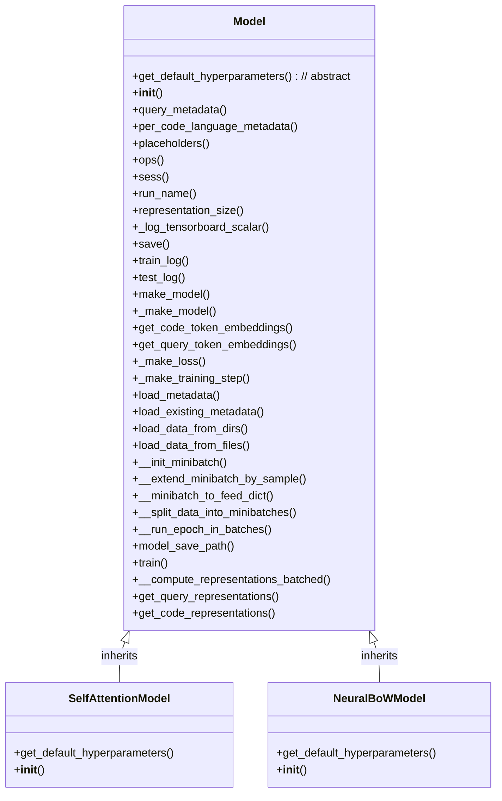
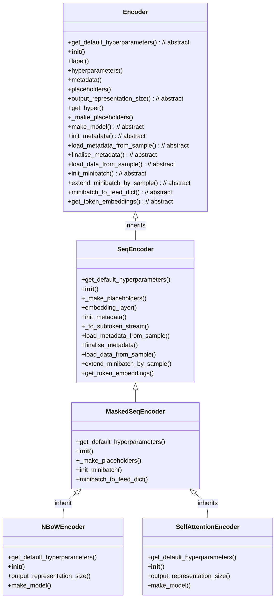
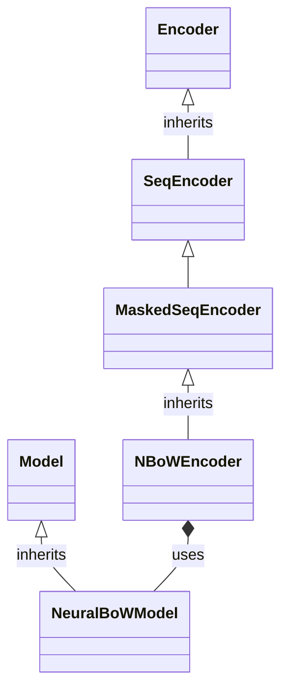
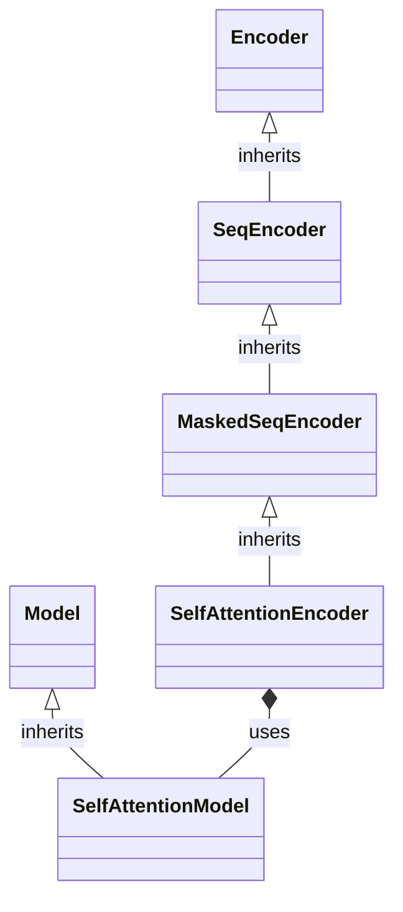

# CodeSearchNet Class Diagrams
---
title : Model
---

```mermaid
classDiagram
    class Model{
        +get_default_hyperparameters() // abstract
        +__init__()
        +query_metadata()
        +per_code_language_metadata()
        +placeholders()
        +ops()
        +sess()
        +run_name()
        +representation_size()
        +_log_tensorboard_scalar()
        +save()
        +train_log()
        +test_log()
        +make_model()
        +_make_model()
        +get_code_token_embeddings()
        +get_query_token_embeddings()
        +_make_loss()
        +_make_training_step()
        +load_metadata()
        +load_existing_metadata()
        +load_data_from_dirs()
        +load_data_from_files()
        +__init_minibatch()
        +__extend_minibatch_by_sample()
        +__minibatch_to_feed_dict()
        +__split_data_into_minibatches()
        +__run_epoch_in_batches()
        +model_save_path()
        +train()
        +__compute_representations_batched()
        +get_query_representations()
        +get_code_representations()
    }

    class NeuralBoWModel{
        +get_default_hyperparameters()
        +__init__()
    }

    class SelfAttentionModel{
        +get_default_hyperparameters()
        +__init__()
    }

    Model <|-- SelfAttentionModel : inherits
    Model <|-- NeuralBoWModel : inherits
```

---
title : Encoder
---

```mermaid
classDiagram
    class Encoder{
        +get_default_hyperparameters() // abstract
        +__init__()
        +label()
        +hyperparameters()
        +metadata()
        +placeholders()
        +output_representation_size() // abstract
        +get_hyper()
        +_make_placeholders()
        +make_model() // abstract
        +init_metadata() // abstract
        +load_metadata_from_sample() // abstract
        +finalise_metadata() // abstract
        +load_data_from_sample() // abstract
        +init_minibatch() // abstract
        +extend_minibatch_by_sample() // abstract
        +minibatch_to_feed_dict() // abstract
        +get_token_embeddings() // abstract
    }

    class MaskedSeqEncoder{
        +get_default_hyperparameters()
        +__init__()
        +_make_placeholders()
        +init_minibatch()
        +minibatch_to_feed_dict()
    }

    class SeqEncoder{
        +get_default_hyperparameters()
        +__init__()
        +_make_placeholders()
        +embedding_layer()
        +init_metadata()
        +_to_subtoken_stream()
        +load_metadata_from_sample()
        +finalise_metadata()
        +load_data_from_sample()
        +extend_minibatch_by_sample()
        +get_token_embeddings()
    }

    class NBoWEncoder{
        +get_default_hyperparameters()
        +__init__()
        +output_representation_size()
        +make_model()
    }

    class SelfAttentionEncoder{
        +get_default_hyperparameters()
        +__init__()
        +output_representation_size()
        +make_model()
    }
    Encoder <|-- SeqEncoder : inherits
    SeqEncoder <|-- MaskedSeqEncoder
    MaskedSeqEncoder <|-- NBoWEncoder : inherit
    MaskedSeqEncoder <|--  SelfAttentionEncoder : inherits
```

---
title : NeuralBoWModel
---

```mermaid
classDiagram

    class Encoder{
        
    }

    class MaskedSeqEncoder{
        
    }

    class NBoWEncoder{
        
    }

    class SeqEncoder{
        
    }

    class Model{

    }

    class NeuralBoWModel{
    }

    Encoder <|-- SeqEncoder: inherits
    SeqEncoder <|-- MaskedSeqEncoder
    MaskedSeqEncoder <|-- NBoWEncoder : inherits
    Model <|-- NeuralBoWModel : inherits
    NBoWEncoder *-- NeuralBoWModel : uses

```
---
title : SelfAttentionModel
---

```mermaid
classDiagram

    class Encoder{
        
    }

    class MaskedSeqEncoder{
        
    }

    class SeqEncoder{
        
    }

    class Model{
        
    }

    class SelfAttentionModel{
        
    }

    class SelfAttentionEncoder{
        
    }
    Encoder <|-- SeqEncoder : inherits
    SeqEncoder <|-- MaskedSeqEncoder : inherits
    MaskedSeqEncoder <|-- SelfAttentionEncoder   : inherits
    Model <|-- SelfAttentionModel : inherits
    SelfAttentionEncoder *-- SelfAttentionModel : uses

```