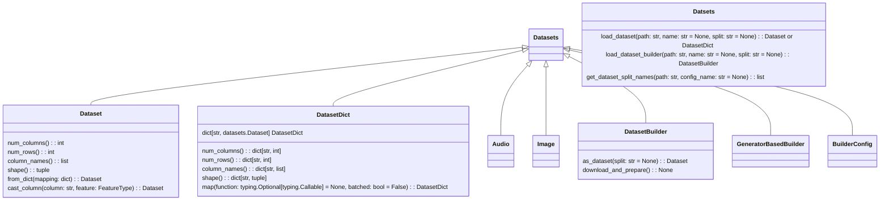

## Datasets Class Diagram

```mermaid
classDiagram
    Datasets <|-- Dataset
    Datasets <|-- DatasetDict
    Datasets <|-- Audio
    Datasets <|-- Image
    Datasets <|-- DatasetBuilder
    Datasets <|-- GeneratorBasedBuilder
    Datasets <|-- BuilderConfig

    class Datsets{
        load_dataset(path: str, name: str = None, split: str = None): Dataset or DatasetDict
        load_dataset_builder(path: str, name: str = None, split: str = None): DatasetBuilder
        get_dataset_split_names(path: str, config_name: str = None): list
    }

    class Dataset{
        num_columns(): int
        num_rows(): int
        column_names(): list
        shape(): tuple
        from_dict(mapping: dict): Dataset
        cast_column(column: str, feature: FeatureType): Dataset
    }

    class DatasetDict{
        dict[str, datasets.Dataset] DatasetDict
        num_columns(): dict[str, int]
        num_rows(): dict[str, int]
        column_names(): dict[str, list]
        shape(): dict[str, tuple]
        map(function: typing.Optional[typing.Callable] = None, batched: bool = False): DatasetDict
    }

    class Audio{
    }

    class Image{
    }

    class DatasetBuilder{
        as_dataset(split: str = None): Dataset
        download_and_prepare(): None
    }

    class BuilderConfig{
    }

    class GeneratorBasedBuilder{
    }

``` 