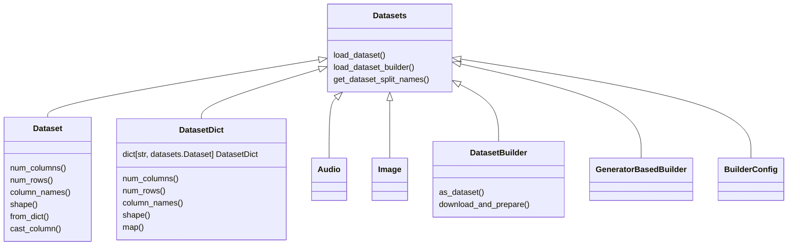

## Datasets Class Diagram

```mermaid
classDiagram
    Datasets <|-- Dataset
    Datasets <|-- DatasetDict
    Datasets <|-- Audio
    Datasets <|-- Image
    Datasets <|-- DatasetBuilder
    Datasets <|-- GeneratorBasedBuilder
    Datasets <|-- BuilderConfig

    class Datasets{
        load_dataset()
        load_dataset_builder()
        get_dataset_split_names()
    }

    class Dataset{
        num_columns()
        num_rows()
        column_names()
        shape()
        from_dict()
        cast_column()
    }

    class DatasetDict{
        dict[str, datasets.Dataset] DatasetDict
        num_columns()
        num_rows()
        column_names()
        shape()
        map()
    }

    class Audio{
    }

    class Image{
    }

    class DatasetBuilder{
        as_dataset()
        download_and_prepare()
    }

    class BuilderConfig{
    }

    class GeneratorBasedBuilder{
    }

``` 