# pyrobot Class Diagram

---
title : locobot
---
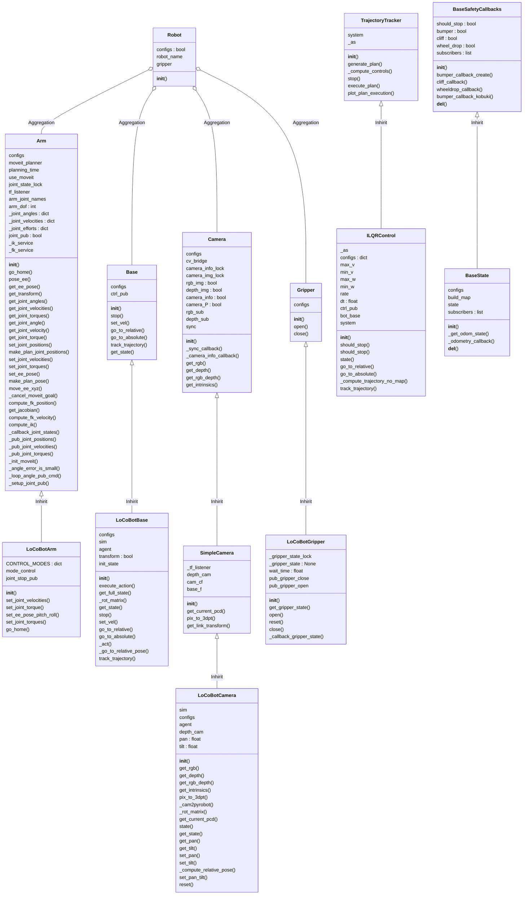

---
title : allegro_hand
---
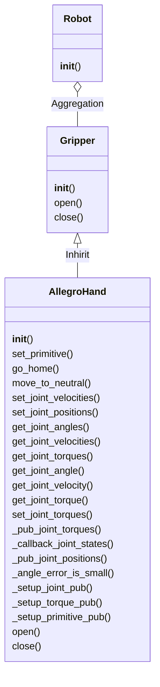

---
title : azure_kinect
---
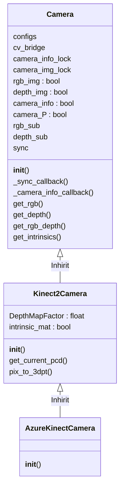

---
title : core
---
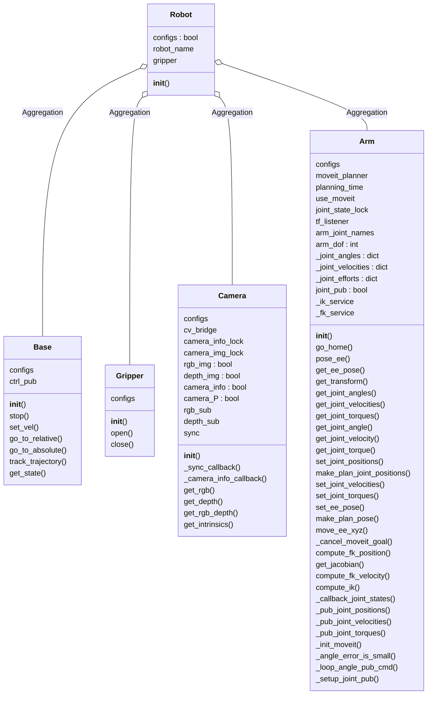

---
title : habitat
---
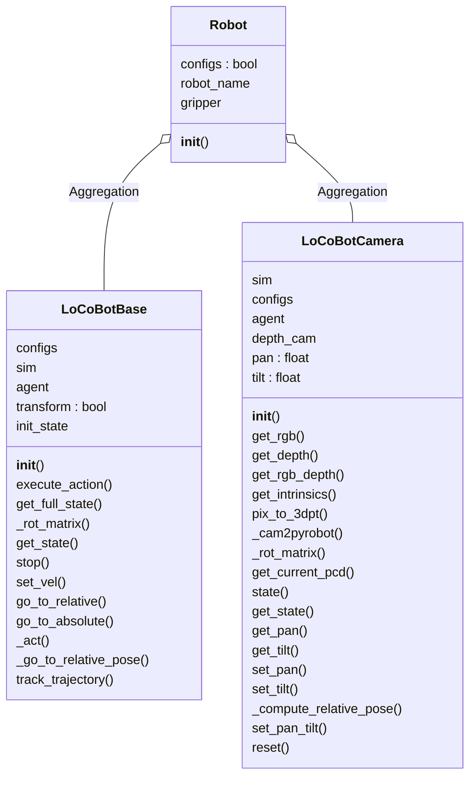

---
title : kinect2
---
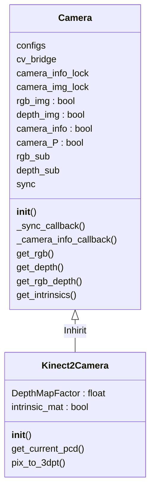

---
title : sawyer
---
```mermaid
classDiagram
    Arm <|-- SawyerArm : Inhirit
    Gripper <|-- SawyerGripper : Inhirit
    SawyerArm *-- SawyerGripper : Composition
    Robot o-- Arm : Aggregation
    Robot o-- Gripper : Aggregation
    class Robot{
    configs : bool
    robot_name
    gripper
    __init__()
    }
    class Gripper{
        configs
        __init__()
        open()
        close()
    }
    class Arm{
        configs
        moveit_planner
        planning_time
        use_moveit
        joint_state_lock
        tf_listener
        arm_joint_names
        arm_dof : int
        _joint_angles : dict
        _joint_velocities : dict
        _joint_efforts : dict
        joint_pub : bool
        _ik_service
        _fk_service
        __init__()
        go_home()
        pose_ee()
        get_ee_pose()
        get_transform()
        get_joint_angles()
        get_joint_velocities()
        get_joint_torques()
        get_joint_angle()
        get_joint_velocity()
        get_joint_torque()
        set_joint_positions()
        make_plan_joint_positions()
        set_joint_velocities()
        set_joint_torques()
        set_ee_pose()
        make_plan_pose()
        move_ee_xyz()
        _cancel_moveit_goal()
        compute_fk_position()
        get_jacobian()
        compute_fk_velocity()
        compute_ik()
        _callback_joint_states()
        _pub_joint_positions()
        _pub_joint_velocities()
        _pub_joint_torques()
        _init_moveit()
        _angle_error_is_small()
        _loop_angle_pub_cmd()
        _setup_joint_pub()
    }
    class SawyerArm{
        collision_state_sub
        configs
        moveit_planner : str
        use_moveit : bool
        __init__()
        go_home()
        move_to_neutral()
        get_collision_state()
        _setup_joint_pub()
        _callback_collision()
        _pub_joint_positions()
        _pub_joint_velocities()
        _pub_joint_torques()
    }
    class SawyerGripper{
        wait_time : float
        gripper
        __init__()
        open()
        reset()
        close()
    }
```

---
title : ur5
---
```mermaid
classDiagram
    Arm <|-- UR5Arm : Inhirit
    Gripper <|-- AllegroHand : Inhirit
    UR5Arm o-- AllegroHand : Aggregation
    Robot o-- Arm : Aggregation
    Robot o-- Gripper : Aggregation
    class Robot{
    configs : bool
    robot_name
    gripper
    __init__()
    }
    class Gripper{
        configs
        __init__()
        open()
        close()
    }
    class Arm{
        configs
        moveit_planner
        planning_time
        use_moveit
        joint_state_lock
        tf_listener
        arm_joint_names
        arm_dof : int
        _joint_angles : dict
        _joint_velocities : dict
        _joint_efforts : dict
        joint_pub : bool
        _ik_service
        _fk_service
        __init__()
        go_home()
        pose_ee()
        get_ee_pose()
        get_transform()
        get_joint_angles()
        get_joint_velocities()
        get_joint_torques()
        get_joint_angle()
        get_joint_velocity()
        get_joint_torque()
        set_joint_positions()
        make_plan_joint_positions()
        set_joint_velocities()
        set_joint_torques()
        set_ee_pose()
        make_plan_pose()
        move_ee_xyz()
        _cancel_moveit_goal()
        compute_fk_position()
        get_jacobian()
        compute_fk_velocity()
        compute_ik()
        _callback_joint_states()
        _pub_joint_positions()
        _pub_joint_velocities()
        _pub_joint_torques()
        _init_moveit()
        _angle_error_is_small()
        _loop_angle_pub_cmd()
        _setup_joint_pub()
    }
    class AllegroHand{
        __init__()
        set_primitive()
        go_home()
        move_to_neutral()
        set_joint_velocities()
        set_joint_positions()
        get_joint_angles()
        get_joint_velocities()
        get_joint_torques()
        get_joint_angle()
        get_joint_velocity()
        get_joint_torque()
        set_joint_torques()
        _pub_joint_torques()
        _callback_joint_states()
        _pub_joint_positions()
        _angle_error_is_small()
        _setup_joint_pub()
        _setup_torque_pub()
        _setup_primitive_pub()
        open()
        close()
    } 
    class UR5Arm{
        __init__()
        go_home()
        move_to_neutral()
        _setup_joint_pub()
        _pub_joint_positions()
        _pub_joint_velocities()
        _pub_joint_torques()
        set_joint_velocities()
    }
```

---
title : util
---
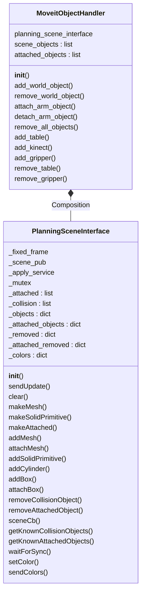

---
title : vrep_locobot
---
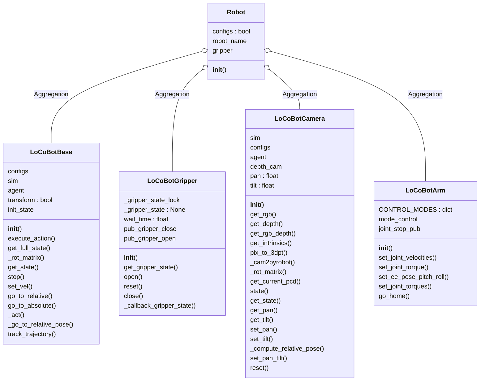

---
title : vx300s
---
```mermaid
classDiagram
    Arm <|-- vx300sArm : Inhirit
    Camera <|-- SimpleCamera : Inhirit
    SimpleCamera <|-- LoCoBotCamera : Inhirit
    Gripper <|-- vx300sGripper : Inhirit
    vx300sArm *-- vx300sGripper : Composition
    vx300sArm o-- LoCoBotCamera : Aggregation
    LoCoBotCamera o-- DepthImgProcesso : Aggregation
    Robot o-- Gripper : Aggregation
    Robot o-- Camera : Aggregation
    Robot o-- Arm : Aggregation
    class Robot{
        configs : bool
        robot_name
        gripper
        __init__()
    }
    class LoCoBotCamera{
        sim
        configs
        agent
        depth_cam
        pan : float
        tilt : float
        __init__()
        get_rgb()
        get_depth()
        get_rgb_depth()
        get_intrinsics()
        pix_to_3dpt()
        _cam2pyrobot()
        _rot_matrix()
        get_current_pcd()
        state()
        get_state()
        get_pan()
        get_tilt()
        set_pan()
        set_tilt()
        _compute_relative_pose()
        set_pan_tilt()
        reset()
    }
    class Gripper{
        configs
        __init__()
        open()
        close()
    }
    class Camera{
        configs
        cv_bridge
        camera_info_lock
        camera_img_lock
        rgb_img : bool
        depth_img : bool
        camera_info : bool
        camera_P : bool
        rgb_sub
        depth_sub
        sync
        __init__()
        _sync_callback()
        _camera_info_callback()
        get_rgb()
        get_depth()
        get_rgb_depth()
        get_intrinsics()
    }
    class Arm{
        configs
        moveit_planner
        planning_time
        use_moveit
        joint_state_lock
        tf_listener
        arm_joint_names
        arm_dof : int
        _joint_angles : dict
        _joint_velocities : dict
        _joint_efforts : dict
        joint_pub : bool
        _ik_service
        _fk_service
        __init__()
        go_home()
        pose_ee()
        get_ee_pose()
        get_transform()
        get_joint_angles()
        get_joint_velocities()
        get_joint_torques()
        get_joint_angle()
        get_joint_velocity()
        get_joint_torque()
        set_joint_positions()
        make_plan_joint_positions()
        set_joint_velocities()
        set_joint_torques()
        set_ee_pose()
        make_plan_pose()
        move_ee_xyz()
        _cancel_moveit_goal()
        compute_fk_position()
        get_jacobian()
        compute_fk_velocity()
        compute_ik()
        _callback_joint_states()
        _pub_joint_positions()
        _pub_joint_velocities()
        _pub_joint_torques()
        _init_moveit()
        _angle_error_is_small()
        _loop_angle_pub_cmd()
        _setup_joint_pub()
    }
    class SimpleCamera{
        _tf_listener
        depth_cam
        cam_cf
        base_f
        __init__()
        get_current_pcd()
        pix_to_3dpt()
        get_link_transform()
    }
    class vx300sArm{
        configs
        moveit_planner
        use_moveit : bool
        __init__()
        go_home()
        move_to_neutral()
        _setup_joint_pub()
        _pub_joint_positions()
        _pub_joint_velocities()
        _pub_joint_torques()
        set_joint_velocities()
    }
    class vx300sGripper{
        gripper
        wait_time : float
        __init__()
        open()
        set_gripper_pressure()
        close()
    }
    class DepthImgProcesso{
        subsample_pixs : int
        depth_threshold : tuples
        cfg_data
        intrinsic_mat
        intrinsic_mat_inv
        uv_one
        uv_one_in_cam
        __init__()
        get_pix_3dpt()
        get_pcd_ic()
        get_pcd_iw()
        read_cfg()
        get_intrinsic()
    }
```

