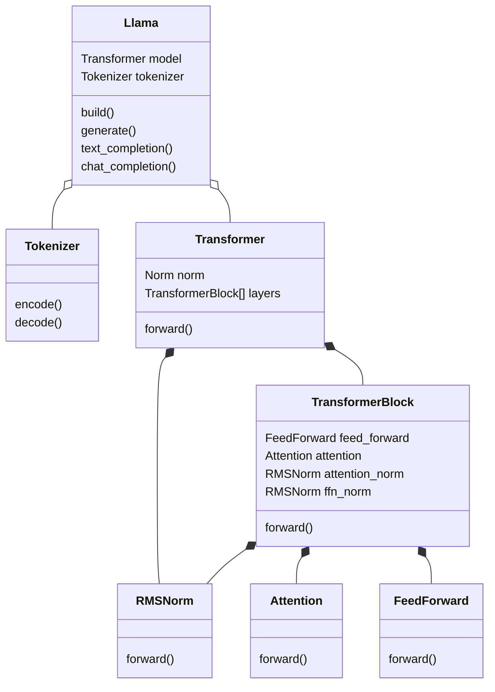

# LLaMA Class Diagrams

```mermaid
classDiagram
    class Llama{
        Transformer model
        Tokenizer tokenizer
        build()
        generate()
        text_completion()
        chat_completion()
    }
    class Tokenizer{
        encode()
        decode()
    }
    class RMSNorm{
        forward()
    }
    class Attention{
        forward()
    }
    class FeedForward{
        forward()
    }
    class TransformerBlock{
        FeedForward feed_forward
        Attention attention
        RMSNorm attention_norm
        RMSNorm ffn_norm
        forward()
    }
    class Transformer{
        Norm norm
        TransformerBlock[] layers
        forward()
    }
    Llama o-- Transformer
    Llama o-- Tokenizer
    Transformer *-- RMSNorm
    Transformer *-- TransformerBlock
    TransformerBlock *-- RMSNorm
    TransformerBlock *-- Attention
    TransformerBlock *-- FeedForward
```
