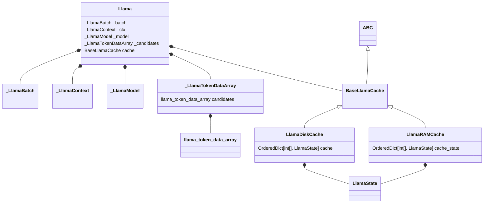

# llama-cpp-python Class Diagrams

```mermaid
classDiagram
    class Llama{
        _LlamaBatch _batch
        _LlamaContext _ctx
        _LlamaModel _model
        _LlamaTokenDataArray _candidates
        BaseLlamaCache cache
    }

    class _LlamaBatch{
    }

    class _LlamaContext{
    }

    class _LlamaModel{
    }

    class _LlamaTokenDataArray{
        llama_token_data_array candidates
    }

    class BaseLlamaCache

    class LlamaDiskCache{
        OrderedDict[int[], LlamaState] cache
    }

    class LlamaRAMCache{
        OrderedDict[int[], LlamaState] cache_state
    }
    Llama *-- _LlamaBatch
    Llama *-- _LlamaContext
    Llama *-- _LlamaModel
    Llama *-- _LlamaTokenDataArray
    Llama *-- BaseLlamaCache
    _LlamaTokenDataArray *-- llama_token_data_array
    ABC <|-- BaseLlamaCache
    BaseLlamaCache <|-- LlamaDiskCache
    BaseLlamaCache <|-- LlamaRAMCache
    LlamaRAMCache *-- LlamaState
    LlamaDiskCache *-- LlamaState

```
