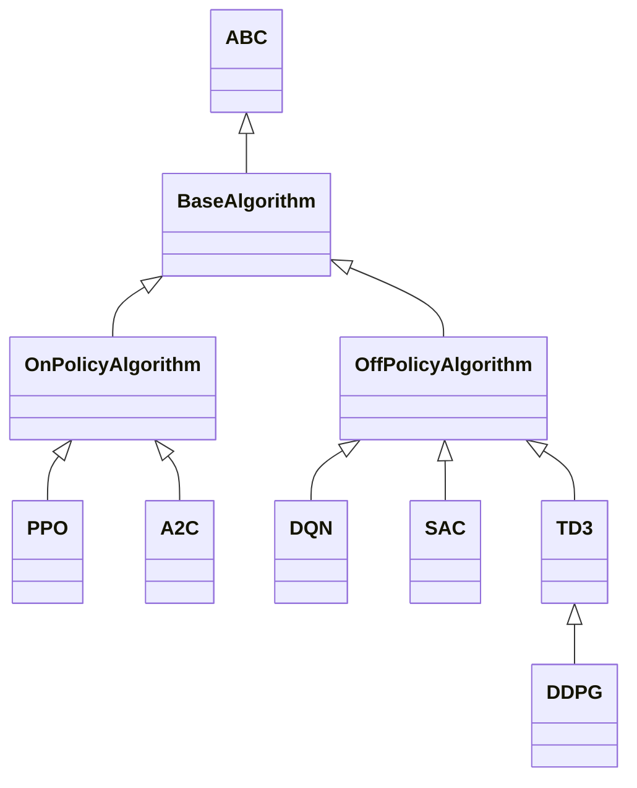
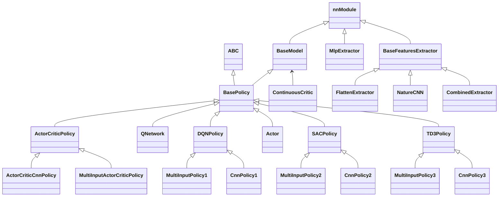
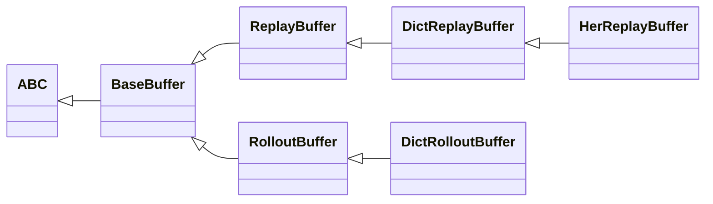
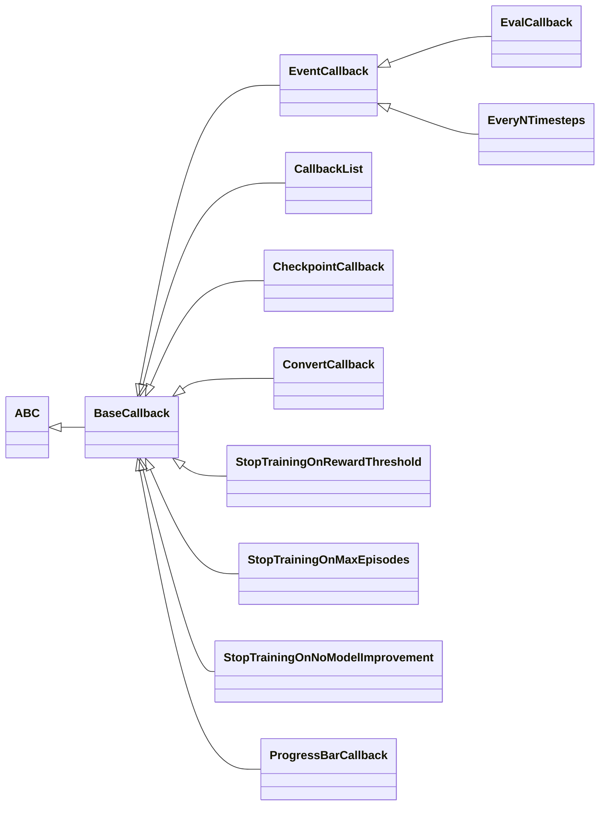
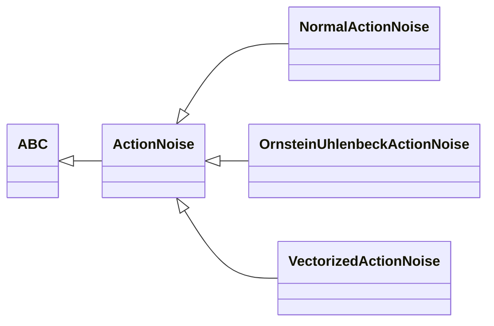
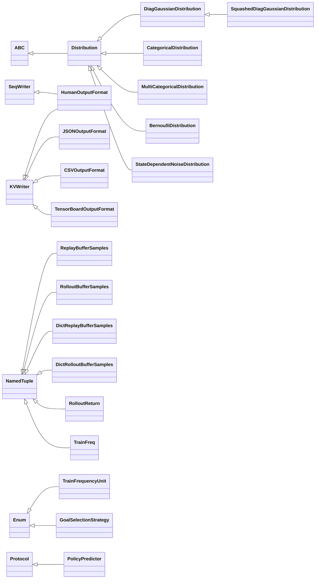

# Stable Baselines3 Class Diagrams

```mermaid
classDiagram
    ABC <|-- BaseAlgorithm
    BaseAlgorithm <|-- OnPolicyAlgorithm
    BaseAlgorithm <|-- OffPolicyAlgorithm

    OnPolicyAlgorithm <|-- PPO
    OnPolicyAlgorithm <|-- A2C

    OffPolicyAlgorithm <|-- DQN
    OffPolicyAlgorithm <|-- SAC
    OffPolicyAlgorithm <|-- TD3

    TD3 <|-- DDPG
```

```mermaid
classDiagram
    nnModule <|-- BaseModel
    nnModule <|-- BaseFeaturesExtractor
    nnModule <|-- MlpExtractor

    BaseModel <|-- BasePolicy
    BaseModel <-- ContinuousCritic
    ABC <|-- BasePolicy

    BasePolicy <|-- ActorCriticPolicy
    BasePolicy <|-- QNetwork
    BasePolicy <|-- DQNPolicy
    BasePolicy <|-- Actor
    BasePolicy <|-- SACPolicy
    BasePolicy <|-- TD3Policy

    DQNPolicy <|-- MultiInputPolicy1
    SACPolicy <|-- MultiInputPolicy2
    TD3Policy <|-- MultiInputPolicy3
    DQNPolicy <|-- CnnPolicy1
    SACPolicy <|-- CnnPolicy2
    TD3Policy <|-- CnnPolicy3

    ActorCriticPolicy <|-- ActorCriticCnnPolicy
    ActorCriticPolicy <|-- MultiInputActorCriticPolicy

    BaseFeaturesExtractor <|-- FlattenExtractor
    BaseFeaturesExtractor <|-- NatureCNN
    BaseFeaturesExtractor <|-- CombinedExtractor

```

```mermaid
classDiagram
    direction LR:
    ABC <|-- BaseBuffer
    BaseBuffer <|-- ReplayBuffer
    BaseBuffer <|-- RolloutBuffer

    ReplayBuffer  <|-- DictReplayBuffer
    RolloutBuffer <|-- DictRolloutBuffer

    DictReplayBuffer <|-- HerReplayBuffer

    
```

```mermaid
classDiagram
    direction LR:
    ABC <|-- BaseCallback
    BaseCallback <|-- EventCallback
    BaseCallback <|-- CallbackList
    BaseCallback <|-- CheckpointCallback
    BaseCallback <|-- ConvertCallback
    EventCallback <|-- EvalCallback
    BaseCallback <|-- StopTrainingOnRewardThreshold
    EventCallback <|-- EveryNTimesteps
    BaseCallback <|-- StopTrainingOnMaxEpisodes
    BaseCallback <|-- StopTrainingOnNoModelImprovement
    BaseCallback <|-- ProgressBarCallback
```

```mermaid
classDiagram
    direction LR:
    ABC <|-- ActionNoise
    ActionNoise <|-- NormalActionNoise
    ActionNoise <|-- OrnsteinUhlenbeckActionNoise
    ActionNoise <|-- VectorizedActionNoise
```

```mermaid
classDiagram
    direction LR:
    ABC <|-- Distribution
    Distribution <|-- DiagGaussianDistribution
    DiagGaussianDistribution <|-- SquashedDiagGaussianDistribution
    Distribution <|-- CategoricalDistribution
    Distribution <|-- MultiCategoricalDistribution
    Distribution <|-- BernoulliDistribution
    Distribution <|-- StateDependentNoiseDistribution
    
    KVWriter <|-- HumanOutputFormat
    KVWriter <|-- JSONOutputFormat
    KVWriter <|-- CSVOutputFormat
    KVWriter <|-- TensorBoardOutputFormat
    SeqWriter <|-- HumanOutputFormat

    NamedTuple <|-- ReplayBufferSamples
    NamedTuple <|-- RolloutBufferSamples
    NamedTuple <|-- DictReplayBufferSamples
    NamedTuple <|-- DictRolloutBufferSamples
    NamedTuple <|-- RolloutReturn
    NamedTuple <|-- TrainFreq

    Enum <|-- TrainFrequencyUnit
    Enum <|-- GoalSelectionStrategy

    Protocol <|-- PolicyPredictor
```
