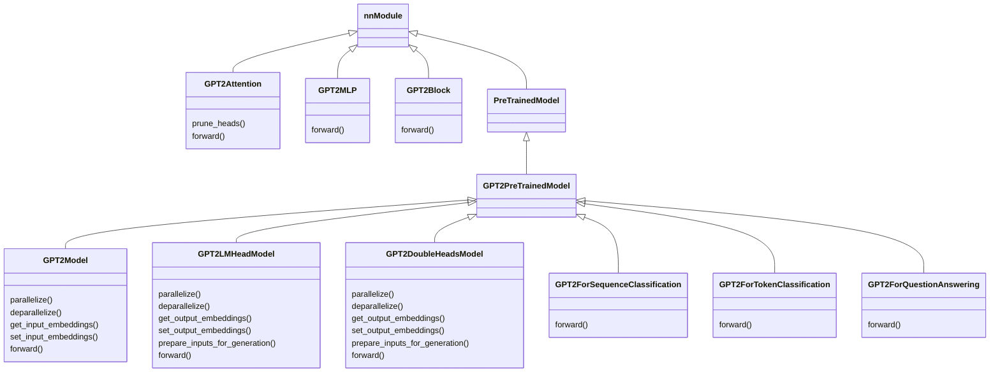
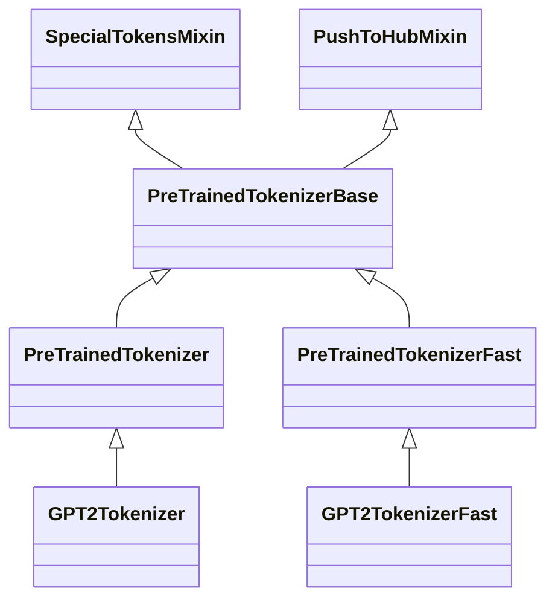

## Transformer Class Diagram - GPT2
### Model

```mermaid
classDiagram
    nnModule <|-- GPT2Attention
    nnModule <|-- GPT2MLP
    nnModule <|-- GPT2Block
    nnModule <|-- PreTrainedModel
    PreTrainedModel <|-- GPT2PreTrainedModel
    GPT2PreTrainedModel <|-- GPT2Model
    GPT2PreTrainedModel <|-- GPT2LMHeadModel
    GPT2PreTrainedModel <|-- GPT2DoubleHeadsModel
    GPT2PreTrainedModel <|-- GPT2ForSequenceClassification
    GPT2PreTrainedModel <|-- GPT2ForTokenClassification
    GPT2PreTrainedModel <|--  GPT2ForQuestionAnswering

    class GPT2MLP{
        forward()
    }

    class GPT2Block{
        forward()
    }

    class GPT2Attention{
        prune_heads()
        forward()
    }

    class GPT2PreTrainedModel{
    }
    class GPT2Model{
 
        parallelize()
        deparallelize()
        get_input_embeddings()
        set_input_embeddings()
        forward()
    }

    class GPT2LMHeadModel{
        parallelize()
        deparallelize()
        get_output_embeddings()
        set_output_embeddings()
        prepare_inputs_for_generation()
        forward()
    }

    class GPT2DoubleHeadsModel{

        parallelize()
        deparallelize()
        get_output_embeddings()
        set_output_embeddings()
        prepare_inputs_for_generation()
        forward()
    }
    
    class GPT2ForSequenceClassification{
        forward()
    }

    class GPT2ForTokenClassification{
        forward()
    }
    
    class GPT2ForQuestionAnswering{
        forward()
    }
``` 
### Tokenizer 

```mermaid
classDiagram
    PreTrainedTokenizer <|-- GPT2Tokenizer
    PreTrainedTokenizerBase <|-- PreTrainedTokenizer
    SpecialTokensMixin  <|-- PreTrainedTokenizerBase
    PushToHubMixin <|-- PreTrainedTokenizerBase

    PreTrainedTokenizerFast <|-- GPT2TokenizerFast
    PreTrainedTokenizerBase  <|-- PreTrainedTokenizerFast


``` 

