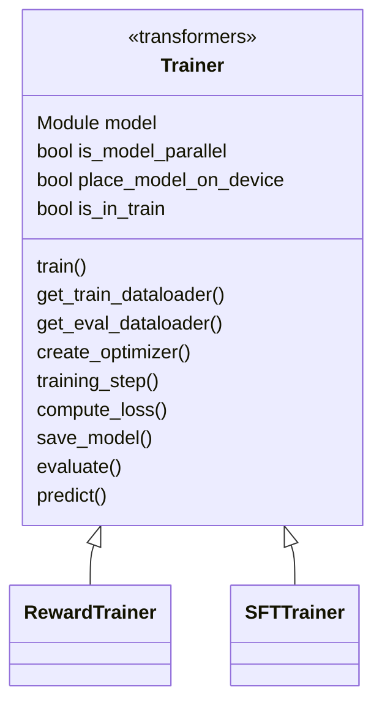
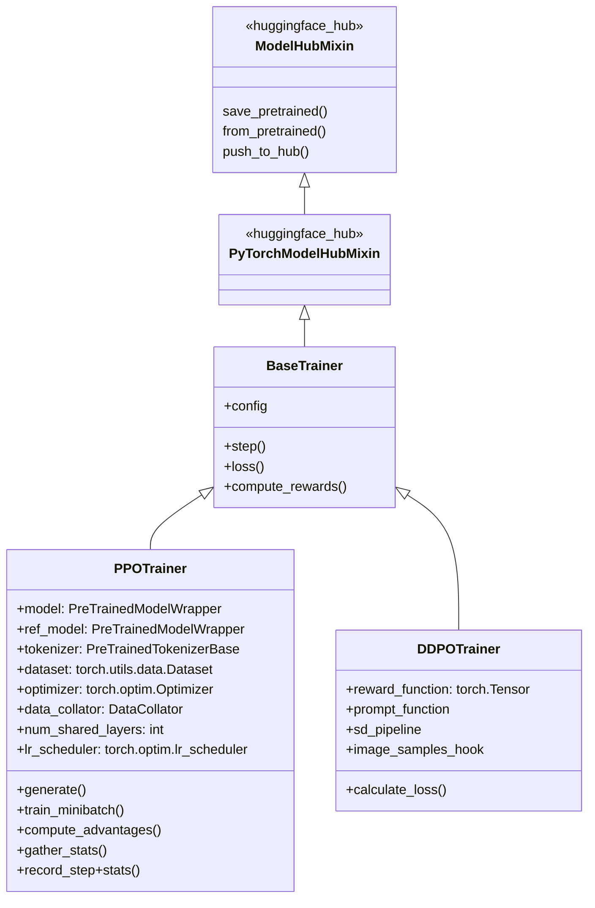
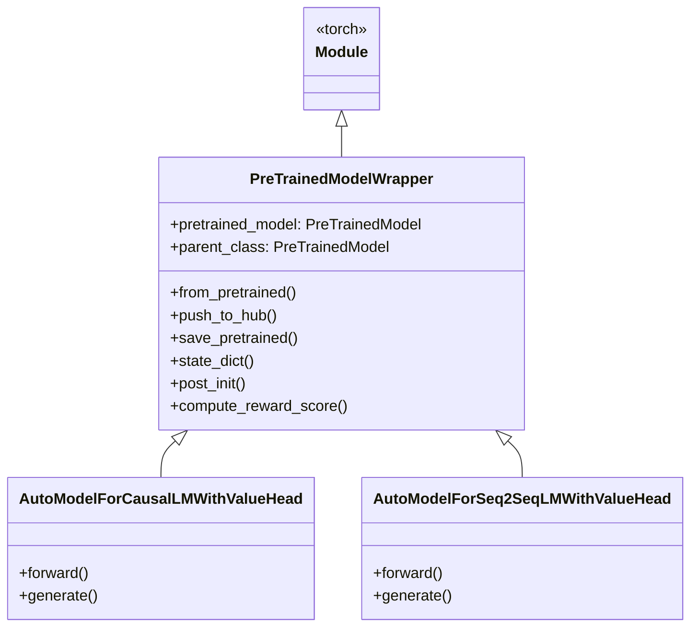

# trl Class Diagrams

```mermaid
classDiagram
    class Trainer{
        Module model
        bool is_model_parallel
        bool place_model_on_device
        bool is_in_train
        train()
        get_train_dataloader()
        get_eval_dataloader()
        create_optimizer()
        training_step()
        compute_loss()
        save_model()
        evaluate()
        predict()
    }
    
    <<transformers>> Trainer
    Trainer <|-- RewardTrainer
    Trainer <|-- SFTTrainer

```

```mermaid
classDiagram
    class PyTorchModelHubMixin
    class ModelHubMixin{
        save_pretrained()
        from_pretrained()
        push_to_hub()
    }
    class BaseTrainer{
        +config
        +step()
        +loss()
        +compute_rewards()
    }
    class PPOTrainer{
        +model: PreTrainedModelWrapper
        +ref_model: PreTrainedModelWrapper
        +tokenizer: PreTrainedTokenizerBase
        +dataset: torch.utils.data.Dataset
        +optimizer: torch.optim.Optimizer
        +data_collator: DataCollator
        +num_shared_layers: int
        +lr_scheduler: torch.optim.lr_scheduler
        +generate()
        +train_minibatch()
        +compute_advantages()
        +gather_stats()
        +record_step+stats()
    }
    class DDPOTrainer{
        +reward_function: torch.Tensor
        +prompt_function
        +sd_pipeline
        +image_samples_hook
        +calculate_loss()
    }
    <<huggingface_hub>> PyTorchModelHubMixin
    <<huggingface_hub>> ModelHubMixin
    
    ModelHubMixin <|-- PyTorchModelHubMixin 
    PyTorchModelHubMixin <|-- BaseTrainer
    BaseTrainer <|-- PPOTrainer
    BaseTrainer <|-- DDPOTrainer
    

```

```mermaid
classDiagram
    class Module
    <<torch>> Module
    class PreTrainedModelWrapper{
        +pretrained_model: PreTrainedModel
        +parent_class: PreTrainedModel
        +from_pretrained()
        +push_to_hub()
        +save_pretrained()
        +state_dict()
        +post_init()
        +compute_reward_score()
    }
    class AutoModelForCausalLMWithValueHead{
        +forward()
        +generate()
    }
    class AutoModelForSeq2SeqLMWithValueHead{
        +forward()
        +generate()
    }

    Module <|-- PreTrainedModelWrapper
    PreTrainedModelWrapper <|--AutoModelForCausalLMWithValueHead
    PreTrainedModelWrapper <|--AutoModelForSeq2SeqLMWithValueHead
```

