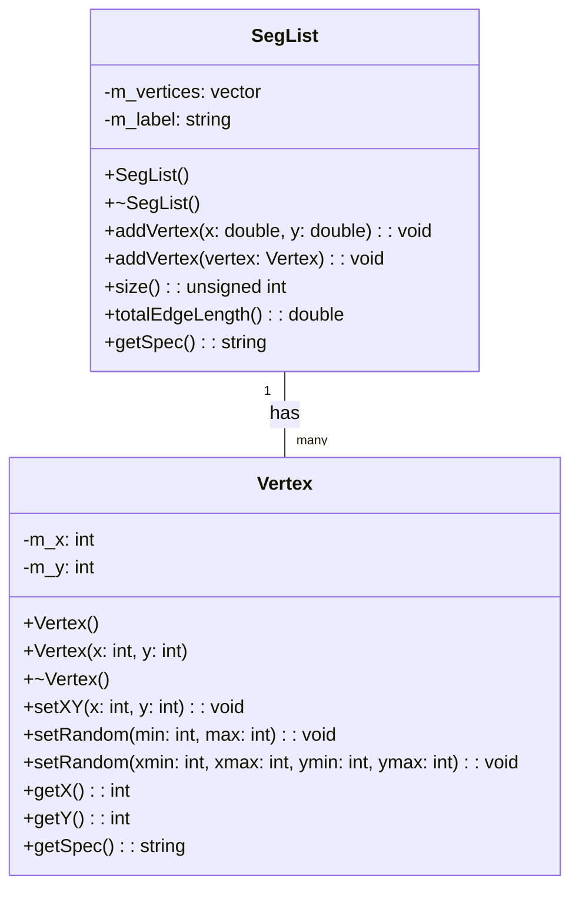

# add mermaid diagram

```mermaid
classDiagram
    class Vertex {
        -m_x: int
        -m_y: int
        +Vertex()
        +Vertex(x: int, y: int)
        +~Vertex()
        +setXY(x: int, y: int): void
        +setRandom(min: int, max: int): void
        +setRandom(xmin: int, xmax: int, ymin: int, ymax: int): void
        +getX(): int
        +getY(): int
        +getSpec(): string
    }

    class SegList {
        -m_vertices: vector<Vertex>
        -m_label: string
        +SegList()
        +~SegList()
        +addVertex(x: double, y: double): void
        +addVertex(vertex: Vertex): void
        +size(): unsigned int
        +totalEdgeLength(): double
        +getSpec(): string
    }

    SegList "1" -- "many" Vertex : has
```
