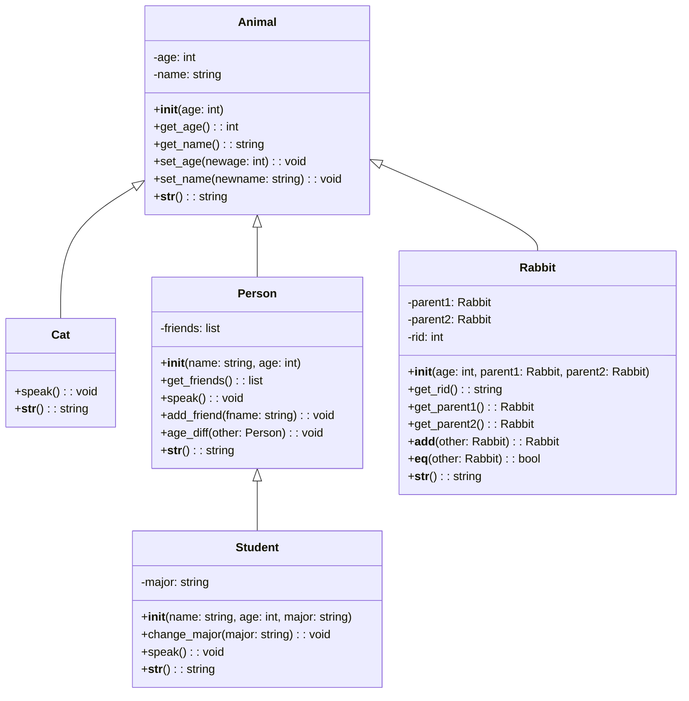

# add mermaid cladd diagram for class Animal

```mermaid
classDiagram
    class Animal {
      -age: int
      -name: string
      +__init__(age: int)
      +get_age(): int
      +get_name(): string
      +set_age(newage: int): void
      +set_name(newname: string): void
      +__str__(): string
    }

    class Cat {
      +speak(): void
      +__str__(): string
    }

    class Person {
      -friends: list
      +__init__(name: string, age: int)
      +get_friends(): list
      +speak(): void
      +add_friend(fname: string): void
      +age_diff(other: Person): void
      +__str__(): string
    }

    class Student {
      -major: string
      +__init__(name: string, age: int, major: string)
      +change_major(major: string): void
      +speak(): void
      +__str__(): string
    }

    class Rabbit {
      -parent1: Rabbit
      -parent2: Rabbit
      -rid: int
      +__init__(age: int, parent1: Rabbit, parent2: Rabbit)
      +get_rid(): string
      +get_parent1(): Rabbit
      +get_parent2(): Rabbit
      +__add__(other: Rabbit): Rabbit
      +__eq__(other: Rabbit): bool
      +__str__(): string
    }

    Animal <|-- Cat
    Animal <|-- Person
    Animal <|-- Rabbit
    Person <|-- Student

```
