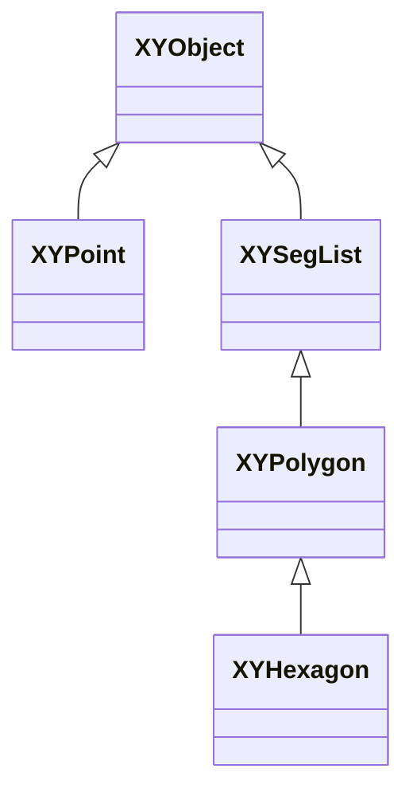
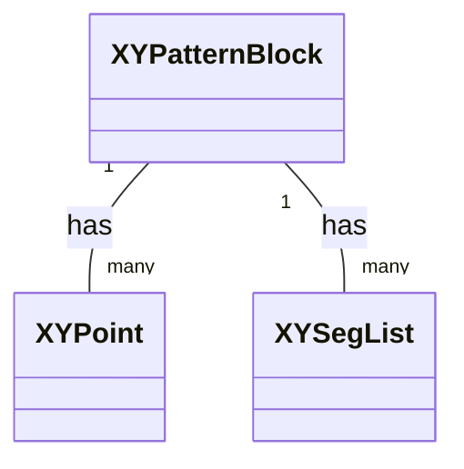
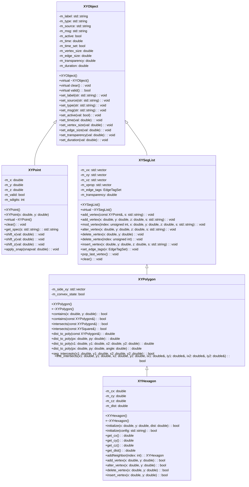

## Overview

```mermaid
classDiagram
    class XYObject {
    }

    class XYPoint {
    }

    class XYSegList {
    }

    class XYPolygon {
    }

    class XYHexagon {
    }

    XYObject <|-- XYPoint
    XYObject <|-- XYSegList
    XYSegList <|-- XYPolygon
    XYPolygon <|-- XYHexagon
```

## Has-A Relationship

```mermaid
classDiagram
    class XYPatternBlock {
    }

    class XYPoint {
    }

    class XYSegList {
    }

    XYPatternBlock "1" -- "many" XYPoint : has
    XYPatternBlock "1" -- "many" XYSegList : has
```

## Detail

```mermaid
classDiagram
    class XYObject {
        +XYObject()
        +virtual ~XYObject()
        +virtual clear(): void
        +virtual valid(): bool
        +set_label(str: std::string): void
        +set_source(str: std::string): void
        +set_type(str: std::string): void
        +set_msg(str: std::string): void
        +set_active(val: bool): void
        +set_time(val: double): void
        +set_vertex_size(val: double): void
        +set_edge_size(val: double): void
        +set_transparency(val: double): void
        +set_duration(val: double): void
        -m_label: std::string
        -m_type: std::string
        -m_source: std::string
        -m_msg: std::string
        -m_active: bool
        -m_time: double
        -m_time_set: bool
        -m_vertex_size: double
        -m_edge_size: double
        -m_transparency: double
        -m_duration: double
    }

    class XYPoint {
        +XYPoint()
        +XYPoint(x: double, y: double)
        +virtual ~XYPoint()
        +clear(): void
        +get_spec(s: std::string): std::string
        +shift_x(val: double): void
        +shift_y(val: double): void
        +shift_z(val: double): void
        +apply_snap(snapval: double): void
        -m_x: double
        -m_y: double
        -m_z: double
        -m_valid: bool
        -m_sdigits: int
    }

    class XYSegList {
        +XYSegList()
        +virtual ~XYSegList()
        +add_vertex(const XYPoint&, s: std::string): void
        +add_vertex(x: double, y: double, z: double, s: std::string): void
        +mod_vertex(index: unsigned int, x: double, y: double, z: double, s: std::string): void
        +alter_vertex(x: double, y: double, z: double, s: std::string): void
        +delete_vertex(x: double, y: double): void
        +delete_vertex(index: unsigned int): void
        +insert_vertex(x: double, y: double, z: double, s: std::string): void
        +set_edge_tags(v: EdgeTagSet): void
        +pop_last_vertex(): void
        +clear(): void
        -m_vx: std::vector<double>
        -m_vy: std::vector<double>
        -m_vz: std::vector<double>
        -m_vprop: std::vector<std::string>
        -m_edge_tags: EdgeTagSet
        -m_transparency: double
    }

    class XYPolygon {
        +XYPolygon()
        +~XYPolygon()
        +contains(x: double, y: double): bool
        +contains(const XYPolygon&): bool
        +intersects(const XYPolygon&): bool
        +intersects(const XYSquare&): bool
        +dist_to_poly(const XYPolygon&): double
        +dist_to_poly(px: double, py: double): double
        +dist_to_poly(x1: double, y1: double, x2: double, y2: double): double
        +dist_to_poly(px: double, py: double, angle: double): double
        +seg_intercepts(x1: double, y1: double, x2: double, y2: double): bool
        +line_intersects(x1: double, y1: double, x2: double, y2: double, ix1: double&, iy1: double&, ix2: double&, iy2: double&): bool
        -m_side_xy: std::vector<int>
        -m_convex_state: bool
    }

class XYHexagon {
        +XYHexagon()
        +~XYHexagon()
        +initialize(x: double, y: double, dist: double): bool
        +initialize(config: std::string): bool
        +get_cx(): double
        +get_cy(): double
        +get_cz(): double
        +get_dist(): double
        +addNeighbor(index: int): XYHexagon
        +add_vertex(x: double, y: double): bool
        +alter_vertex(x: double, y: double): bool
        +delete_vertex(x: double, y: double): bool
        +insert_vertex(x: double, y: double): bool
        -m_cx: double
        -m_cy: double
        -m_cz: double
        -m_dist: double
    }

    XYObject <|-- XYPoint
    XYObject <|-- XYSegList
    XYSegList <|-- XYPolygon
    XYPolygon <|-- XYHexagon
```
