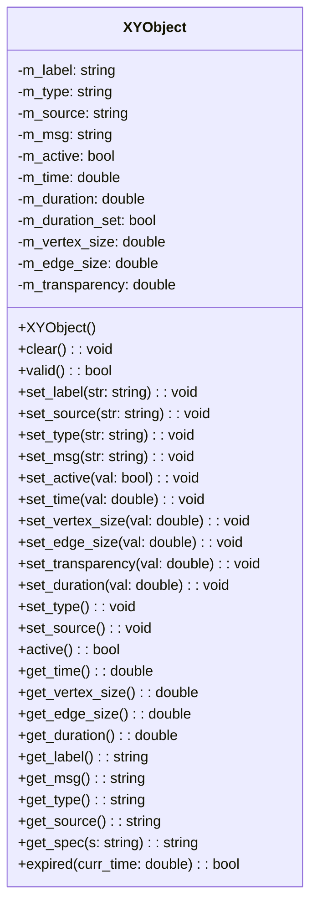

# add mermaid class diagram for object XYObject

```mermaid
classDiagram
    class XYObject {
      -m_label: string
      -m_type: string
      -m_source: string
      -m_msg: string
      -m_active: bool
      -m_time: double
      -m_duration: double
      -m_duration_set: bool
      -m_vertex_size: double
      -m_edge_size: double
      -m_transparency: double
      +XYObject()
      +clear(): void
      +valid(): bool
      +set_label(str: string): void
      +set_source(str: string): void
      +set_type(str: string): void
      +set_msg(str: string): void
      +set_active(val: bool): void
      +set_time(val: double): void
      +set_vertex_size(val: double): void
      +set_edge_size(val: double): void
      +set_transparency(val: double): void
      +set_duration(val: double): void
      +set_type(): void
      +set_source(): void
      +active(): bool
      +get_time(): double
      +get_vertex_size(): double
      +get_edge_size(): double
      +get_duration(): double
      +get_label(): string
      +get_msg(): string
      +get_type(): string
      +get_source(): string
      +get_spec(s: string): string
      +expired(curr_time: double): bool
    }
```
