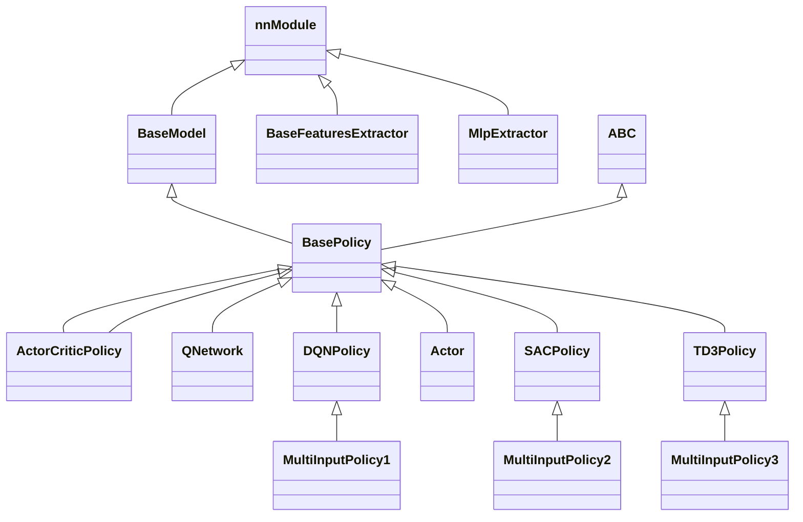
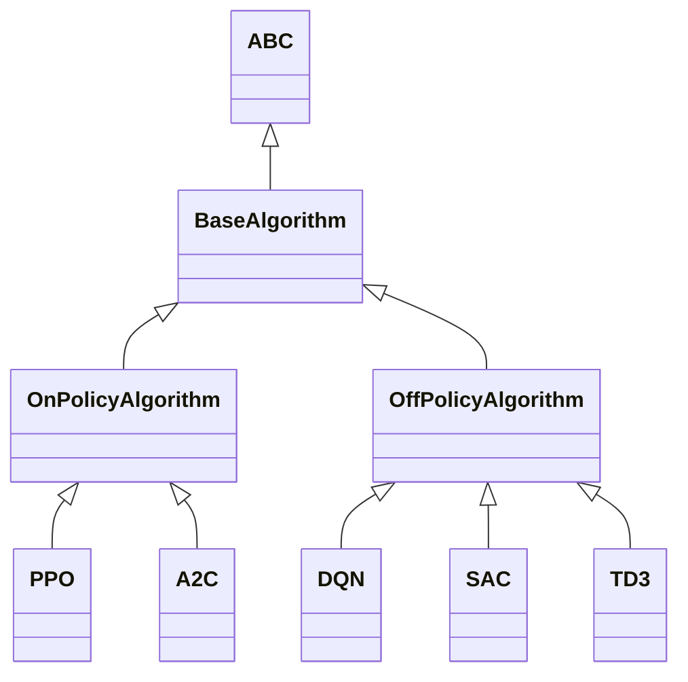
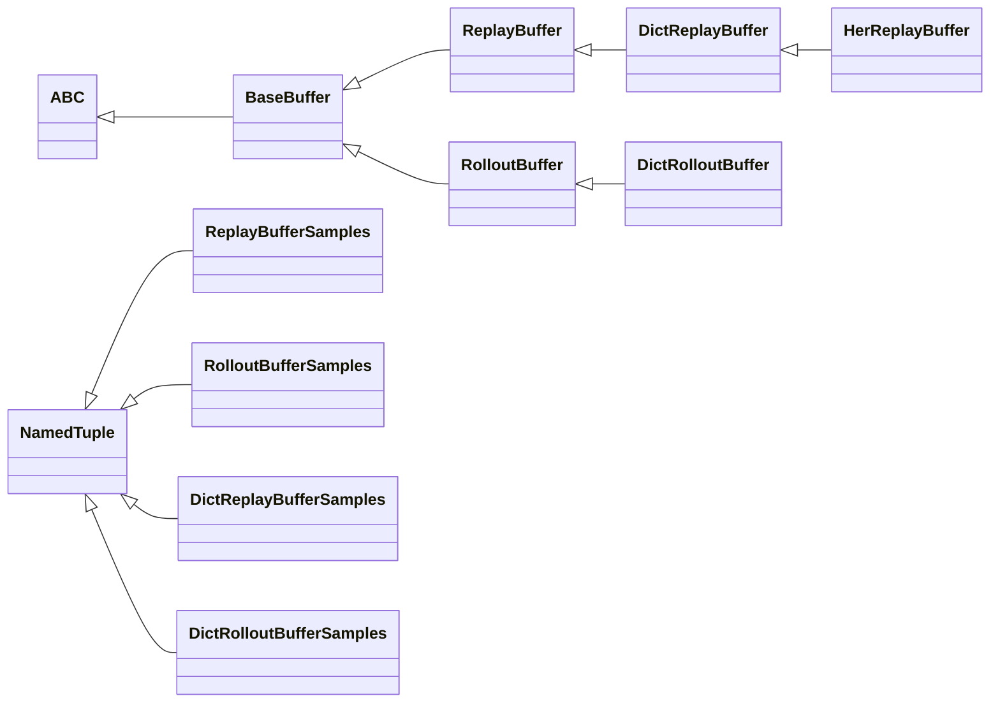
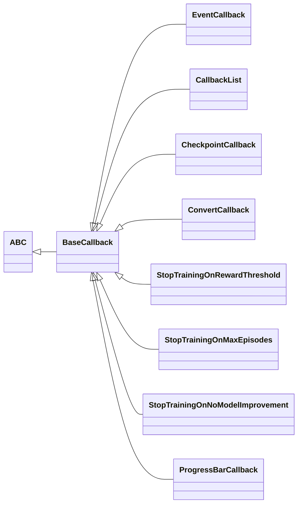

# Stable Baselines3 Class Diagrams

```mermaid
classDiagram
    nnModule <|-- BaseModel
    nnModule <|-- BaseFeaturesExtractor
    nnModule <|-- MlpExtractor

    BaseModel <|-- BasePolicy
    ABC <|-- BasePolicy

    BasePolicy <|-- ActorCriticPolicy
    BasePolicy <|-- QNetwork
    BasePolicy <|-- DQNPolicy
    BasePolicy <|-- Actor
    BasePolicy <|-- SACPolicy
    BasePolicy <|-- ActorCriticPolicy
    BasePolicy <|-- TD3Policy

    DQNPolicy <|-- MultiInputPolicy1
    SACPolicy <|-- MultiInputPolicy2
    TD3Policy <|-- MultiInputPolicy3

    class ActorCriticPolicy{

    }
  
    class BasePolicy{

    }
  
    class BaseFeaturesExtractor{
 
    }

    class BaseModel{

    }

    class nnModule{

    }

    class MlpExtractor {

    }

    class ABC {

    }

```

```mermaid
classDiagram
    ABC <|-- BaseAlgorithm
    BaseAlgorithm <|-- OnPolicyAlgorithm
    BaseAlgorithm <|-- OffPolicyAlgorithm

    OnPolicyAlgorithm <|-- PPO
    OnPolicyAlgorithm <|-- A2C

    OffPolicyAlgorithm <|-- DQN
    OffPolicyAlgorithm <|-- SAC
    OffPolicyAlgorithm <|-- TD3
```

```mermaid
classDiagram
    direction LR:
    ABC <|-- BaseBuffer
    BaseBuffer <|-- ReplayBuffer
    BaseBuffer <|-- RolloutBuffer

    ReplayBuffer  <|-- DictReplayBuffer
    RolloutBuffer <|-- DictRolloutBuffer

    DictReplayBuffer <|-- HerReplayBuffer

    NamedTuple <|-- ReplayBufferSamples
    NamedTuple <|-- RolloutBufferSamples
    NamedTuple <|-- DictReplayBufferSamples
    NamedTuple <|-- DictRolloutBufferSamples


```

```mermaid
classDiagram
    direction LR:
    ABC <|-- BaseCallback
    BaseCallback <|-- EventCallback
    BaseCallback <|-- CallbackList
    BaseCallback <|-- CheckpointCallback
    BaseCallback <|-- ConvertCallback
    BaseCallback <|-- StopTrainingOnRewardThreshold
    BaseCallback <|-- StopTrainingOnMaxEpisodes
    BaseCallback <|-- StopTrainingOnNoModelImprovement
    BaseCallback <|-- ProgressBarCallback
```
