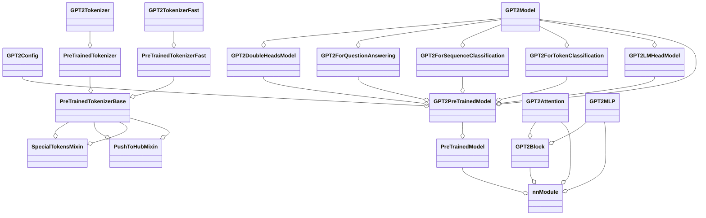

## Transformer Class Diagram - GPT2

```mermaid
classDiagram
    GPT2Config --o GPT2PreTrainedModel 
    GPT2Model --o GPT2DoubleHeadsModel
    GPT2Model --o GPT2ForQuestionAnswering 
    GPT2Model --o GPT2ForSequenceClassification 
    GPT2Model --o GPT2ForTokenClassification 
    GPT2Model --o GPT2LMHeadModel 
    GPT2Model --o GPT2PreTrainedModel 
    GPT2LMHeadModel --o GPT2PreTrainedModel 

    GPT2DoubleHeadsModel --o GPT2PreTrainedModel
    GPT2ForQuestionAnswering --o GPT2PreTrainedModel
    GPT2ForSequenceClassification --o GPT2PreTrainedModel 
    GPT2ForTokenClassification --o GPT2PreTrainedModel 
    GPT2PreTrainedModel --o PreTrainedModel

    GPT2Tokenizer --o PreTrainedTokenizer 
    PreTrainedTokenizer --o PreTrainedTokenizerBase 
    PreTrainedTokenizerBase --o SpecialTokensMixin
    PreTrainedTokenizerBase --o PushToHubMixin

    GPT2TokenizerFast --o PreTrainedTokenizerFast
    PreTrainedTokenizerFast --o PreTrainedTokenizerBase
    PreTrainedTokenizerBase --o SpecialTokensMixin
    PreTrainedTokenizerBase --o PushToHubMixin

    GPT2Attention --o GPT2Block
    GPT2MLP --o GPT2Block 
    GPT2Block --o nnModule 

    PreTrainedModel --o nnModule 
    GPT2Attention --o nnModule 
    GPT2MLP --o nnModule 

``` 

