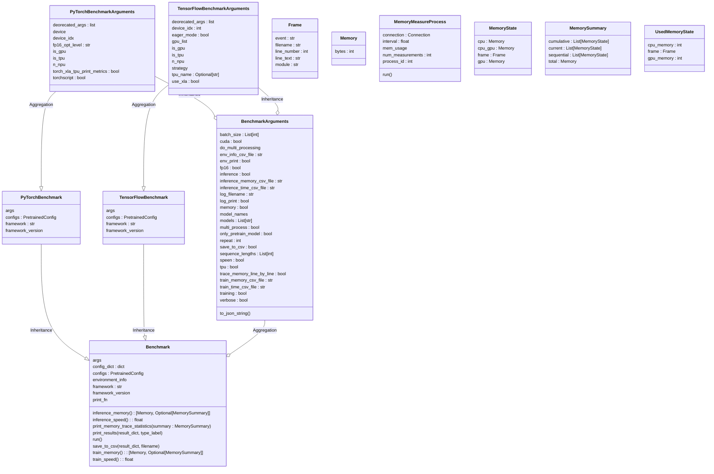

### Transformer Class Diagram - benchmark

```mermaid
classDiagram
    PyTorchBenchmarkArguments --|> PyTorchBenchmark : Aggregation
    PyTorchBenchmarkArguments --o BenchmarkArguments : Inheritance 
    TensorFlowBenchmarkArguments --|> TensorFlowBenchmark : Aggregation
    TensorFlowBenchmarkArguments --o BenchmarkArguments : Inheritance
    PyTorchBenchmark --|> Benchmark : Inheritance
    TensorFlowBenchmark --|> Benchmark : Inheritance
    BenchmarkArguments --o Benchmark : Aggregation

    class PyTorchBenchmarkArguments{
        deorecated_args : list
        device
        device_idx
        fp16_opt_level : str
        is_gpu
        is_tpu
        n_npu
        torch_xla_tpu_print_metrics : bool
        torchscript : bool
    }
    class TensorFlowBenchmarkArguments{
        deorecated_args : list
        device_idx : int
        eager_mode : bool
        gpu_list
        is_gpu
        is_tpu
        n_npu
        strategy
        tpu_name : Optional[str]
        use_xla : bool
    }
    
    class PyTorchBenchmark{
        args
        configs : PretrainedConfig
        framework : str
        framework_version
    }      
    class TensorFlowBenchmark{
        args
        configs : PretrainedConfig
        framework : str
        framework_version
    }
    class BenchmarkArguments{
        batch_size : List[int]
        cuda : bool
        do_multi_processing
        env_info_csv_file : str
        env_print : bool
        fp16 : bool
        inference : bool
        inference_memory_csv_file : str
        inference_time_csv_file : str
        log_filename : str
        log_print : bool
        memory : bool
        model_names
        models : List[str]
        multi_process : bool
        only_pretrain_model : bool
        repeat : int
        save_to_csv : bool
        sequence_lengths : List[int]
        speen : bool
        tpu : bool
        trace_memory_line_by_line : bool
        train_memory_csv_file : str
        train_time_csv_file : str
        training : bool
        verbose : bool
        to_json_string()
    }
    class Benchmark{
        args
        config_dict : dict
        configs : PretrainedConfig
        environment_info
        framework : str
        framework_version
        print_fn
        inference_memory()[Memory, Optional[MemorySummary]]
        inference_speed() : float
        print_memory_trace_statistics(summary : MemorySummary)
        print_results(result_dict, type_label)
        run()
        save_to_csv(result_dict, filename)
        train_memory() : [Memory, Optional[MemorySummary]]
        train_speed() : float
    }

    class Frame{
        event : str
        filename : str
        line_number : int
        line_text : str
        module : str
    }
    class Memory{
        bytes : int
    }
    class MemoryMeasureProcess{
        connection : Connection
        interval : float
        mem_usage
        num_measurements : int
        process_id : int
        run()
    }
    class MemoryState{
        cpu : Memory
        cpu_gpu : Memory
        frame : Frame
        gpu : Memory
    }
    class MemorySummary{
        cumulative : List[MemoryState]
        current : List[MemoryState]
        sequential : List[MemoryState]
        total : Memory
    }

    class UsedMemoryState{
        cpu_memory : int
        frame : Frame
        gpu_memory : int

    }
``` 