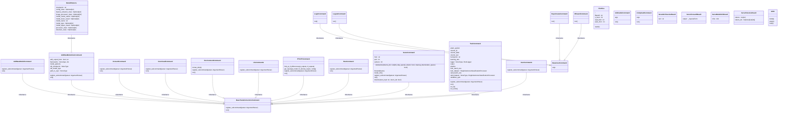

### Transformer Class Diagram - commands

```mermaid
classDiagram
    AddNewModelCommand --|> BaseTransformersCLICommand : Inheritance
    AddNewModelLikeCommand --|> BaseTransformersCLICommand : Inheritance
    ConvertCommand --|> BaseTransformersCLICommand : Inheritance
    DownloadCommand --|> BaseTransformersCLICommand : Inheritance
    EnvironmentCommand --|> BaseTransformersCLICommand : Inheritance
    LfsCommands --|> BaseTransformersCLICommand : Inheritance
    PTtoTFCommand --|> BaseTransformersCLICommand : Inheritance
    RunCommand --|> BaseTransformersCLICommand : Inheritance
    ServeCommand --|> BaseTransformersCLICommand : Inheritance
    TrainCommand --|> BaseTransformersCLICommand : Inheritance
    UserCommands --|> BaseTransformersCLICommand : Inheritance
    ModelPatterns --o AddNewModelLikeCommand : Inheritance
    LoginCommand --|> BaseUserCommand : Inheritance
    LogoutCommand --|> BaseUserCommand : Inheritance
    RepoCreateCommand --|> BaseUserCommand : Inheritance
    WhoamiCommand --|> BaseUserCommand : Inheritance


    class AddNewModelCommand {
        register_subcommand(parser: ArgumentParser)
        run()
    }

    class AddNewModelLikeCommand {
        add_copied_from : bool, str
        frameworks : NoneType, list
        model_patterns
        old_checkpoint : NoneType
        old_model_type
        path_to_repo : NoneType
        register_subcommand(parser: ArgumentParser)
        run()
    }

    class BaseTransformersCLICommand {
        register_subcommand(parser: ArgumentParser)
        run()
    }

    class BaseUserCommand {
        args
    }

    class ConvertCommand {
        register_subcommand(parser: ArgumentParser)
        run()
    }

    class DownloadCommand {
        register_subcommand(parser: ArgumentParser)
        run()
    }

    class EnvironmentCommand {
        format_dict(d)
        register_subcommand(parser: ArgumentParser)
        run()
    }

    class FileSlice {
        f
        filepath : str
        n_seen : int
        read_limit : int
        seek_from : int
        read(n)
    }

    class LfsCommands {
        register_subcommand(parser: ArgumentParser)
    }

    class LfsEnableCommand {
        args
        run()
    }

    class LfsUploadCommand {
        args
        run()
    }

    class LoginCommand {
        run()
    }

    class LogoutCommand {
        run()
    }

    class ModelPatterns {
        checkpoint : str
        config_class : Optional[str]
        feature_extractor_class : Optional[str]
        image_processor_class : Optional[str]
        model_camel_cased : Optional[str]
        model_lower_cased : Optional[str]
        model_name : str
        model_type : Optional[str]
        model_upper_cased : Optional[str]
        processor_class : Optional[str]
        tokenizer_class : Optional[str]
    }

    class PTtoTFCommand {
        find_pt_tf_differences(pt_outputs, tf_outputs)
        get_inputs(pt_model, tf_dummy_inputs, config)
        register_subcommand(parser: ArgumentParser)
        run()
    }

    class RepoCreateCommand {
        run()
    }

    class RunCommand {
        register_subcommand(parser: ArgumentParser)
        run()
    }

    class ServeCommand {
        host : str
        port : int
        workers : int
        detokenize(tokens_ids: List[int], skip_special_tokens: bool, cleanup_tokenization_spaces: bool)
        forward(inputs)
        model_info()
        register_subcommand(parser: ArgumentParser)
        run()
        tokenize(text_input: str, return_ids: bool)
    }

    class ServeDeTokenizeResult {
        text : str
    }

    class ServeForwardResult {
        output : _SpecialForm
    }

    class ServeModelInfoResult {
        infos : dict
    }

    class ServeTokenizeResult {
        tokens : List[str]
        tokens_ids : Optional[List[int]]
    }

    class TrainCommand {
        adam_epsilon
        column_id
        column_label
        column_text
        framework : str
        learning_rate
        logger : NoneType, RootLogger
        output
        pipeline
        train_batch_size
        train_dataset : SingleSentenceClassificationProcessor
        valid_batch_size
        valid_dataset : NoneType, SingleSentenceClassificationProcessor
        validation_split
        register_subcommand(parser: ArgumentParser)
        run()
        run_tf()
        run_torch()
    }
    class ANSI {
        bold(s)
        gray(s)
        red(s)
    }
    class UserCommands {
        register_subcommand(parser: ArgumentParser)
    }

    class WhoamiCommand {
        run()
    }

```