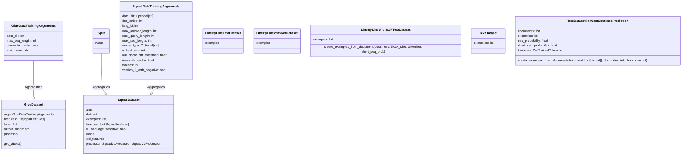

### Transformer Class Diagram - data

```mermaid
classDiagram
 ColaProcessor --|> DataProcessor : Inheritance
    DataCollatorForLanguageModeling --|> DataCollatorMixin : Inheritance
    DataCollatorForPermutationLanguageModeling --|> DataCollatorMixin : Inheritance
    DataCollatorForSOP --|> DataCollatorForLanguageModeling : Inheritance
    DataCollatorForTokenClassification --|> DataCollatorMixin : Inheritance
    DataCollatorForWholeWordMask --|> DataCollatorForLanguageModeling : Inheritance
    DefaultDataCollator --|> DataCollatorMixin : Inheritance
    MnliMismatchedProcessor --|> MnliProcessor : Inheritance
    MnliProcessor --|> DataProcessor : Inheritance
    MrpcProcessor --|> DataProcessor : Inheritance
    QnliProcessor --|> DataProcessor : Inheritance
    QqpProcessor --|> DataProcessor : Inheritance
    RteProcessor --|> DataProcessor : Inheritance
    Sst2Processor --|> DataProcessor : Inheritance
    StsbProcessor --|> DataProcessor : Inheritance
    WnliProcessor --|> DataProcessor : Inheritance
    SquadProcessor --|> DataProcessor : Inheritance
    SingleSentenceClassificationProcessor --|> DataProcessor : Inheritance
    SquadV1Processor --|> SquadProcessor : Inheritance
    SquadV2Processor --|> SquadProcessor : Inheritance
    SquadDataset --o SquadV2Processor : Inheritance
    SquadV1Processor --o SquadDataset : Aggregation
    SquadV2Processor --o SquadDataset : Aggregation
    Split --o SquadDataset : Aggregation
    SquadDataTrainingArguments --|> SquadDataset : Aggregation
    GlueDataTrainingArguments --o GlueDataset : Aggregation

    class SquadDataset{
        args
        dataset
        examples : list
        features : List[SquadFeatures]
        is_language_sensitive : bool
        mode
        old_features
        processor
    }

    class Sst2Processor {
        get_dev_examples(data_dir)
        get_example_from_tensor_dict(tensor_dict)
        get_labels()
        get_test_examples(data_dir)
        get_train_examples(data_dir)
    }

    class StsbProcessor {
        get_dev_examples(data_dir)
        get_example_from_tensor_dict(tensor_dict)
        get_labels()
        get_test_examples(data_dir)
        get_train_examples(data_dir)
    }

    class WnliProcessor {
        get_dev_examples(data_dir)
        get_example_from_tensor_dict(tensor_dict)
        get_labels()
        get_test_examples(data_dir)
        get_train_examples(data_dir)
    }

    class SquadProcessor {
        get_dev_examples(data_dir, filename)
        get_examples_from_dataset(dataset, evaluate)
        get_train_examples(data_dir, filename)
    }

    class SquadV1Processor {
        get_dev_examples(data_dir)
        get_example_from_tensor_dict(tensor_dict)
        get_labels()
        get_test_examples(data_dir)
        get_train_examples(data_dir)
    }

    class SquadV2Processor {
        get_dev_examples(data_dir)
        get_example_from_tensor_dict(tensor_dict)
        get_labels()
        get_test_examples(data_dir)
        get_train_examples(data_dir)
    }

    class ColaProcessor {
        get_dev_examples(data_dir)
        get_example_from_tensor_dict(tensor_dict)
        get_labels()
        get_test_examples(data_dir)
        get_train_examples(data_dir)
    }

    class DataCollatorForLanguageModeling {
        mlm : bool
        mlm_probability : float
        pad_to_multiple_of : Optional[int]
        return_tensors : str
        tf_experimental_compile : bool
        tf_mask_tokens
        tokenizer : PreTrainedTokenizerBase

        numpy_call(examples: List[Union[List[int], Any, Dict[str, Any]]]): Dict[str, Any]
        numpy_mask_tokens(inputs: Any, special_tokens_mask: Optional[Any]): Tuple[Any, Any]
        tf_bernoulli(shape, probability)
        tf_call(examples: List[Union[List[int], Any, Dict[str, Any]]]): Dict[str, Any]
        tf_mask_tokens(inputs: Any, vocab_size, mask_token_id, special_tokens_mask: Optional[Any]): Tuple[Any, Any]
        torch_call(examples: List[Union[List[int], Any, Dict[str, Any]]]): Dict[str, Any]
        torch_mask_tokens(inputs: Any, special_tokens_mask: Optional[Any]): Tuple[Any, Any]
    }

    class DataCollatorForPermutationLanguageModeling {
        max_span_length : int
        plm_probability : float
        return_tensors : str
        tokenizer : PreTrainedTokenizerBase

        numpy_call(examples: List[Union[List[int], Any, Dict[str, Any]]]): Dict[str, Any]
        numpy_mask_tokens(inputs: Any): Tuple[Any, Any, Any, Any]
        tf_call(examples: List[Union[List[int], Any, Dict[str, Any]]]): Dict[str, Any]
        tf_mask_tokens(inputs: Any): Tuple[Any, Any, Any, Any]
        torch_call(examples: List[Union[List[int], Any, Dict[str, Any]]]): Dict[str, Any]
        torch_mask_tokens(inputs: Any): Tuple[Any, Any, Any, Any]
    }

    class DataCollatorForSOP {
        mask_tokens(inputs: Any): Tuple[Any, Any, Any]
    }

    class DataCollatorForSeq2Seq {
        label_pad_token_id : int
        max_length : Optional[int]
        model : Optional[Any]
        pad_to_multiple_of : Optional[int]
        padding : Union[bool, str, PaddingStrategy]
        return_tensors : str
        tokenizer : PreTrainedTokenizerBase
    }

    class DataCollatorForTokenClassification {
        label_pad_token_id : int
        max_length : Optional[int]
        pad_to_multiple_of : Optional[int]
        padding : Union[bool, str, PaddingStrategy]
        return_tensors : str
        tokenizer : PreTrainedTokenizerBase

        numpy_call(features)
        tf_call(features)
        torch_call(features)
    }

    class DataCollatorForWholeWordMask {
        numpy_call(examples: List[Union[List[int], Any, Dict[str, Any]]]): Dict[str, Any]
        numpy_mask_tokens(inputs: Any, mask_labels: Any): Tuple[Any, Any]
        tf_call(examples: List[Union[List[int], Any, Dict[str, Any]]]): Dict[str, Any]
        tf_mask_tokens(inputs: Any, mask_labels: Any): Tuple[Any, Any]
        torch_call(examples: List[Union[List[int], Any, Dict[str, Any]]]): Dict[str, Any]
        torch_mask_tokens(inputs: Any, mask_labels: Any): Tuple[Any, Any]
    }

    class DataCollatorMixin {
    }

    class DataCollatorWithPadding {
        max_length : Optional[int]
        pad_to_multiple_of : Optional[int]
        padding : Union[bool, str, PaddingStrategy]
        return_tensors : str
        tokenizer : PreTrainedTokenizerBase
    }

    class DataProcessor {
        get_dev_examples(data_dir)
        get_example_from_tensor_dict(tensor_dict)
        get_labels()
        get_test_examples(data_dir)
        get_train_examples(data_dir)
        tfds_map(example)
    }

    class DefaultDataCollator {
        return_tensors : str
    }

    class GlueDataTrainingArguments {
        data_dir : str
        max_seq_length : int
        overwrite_cache : bool
        task_name : str
    }

    class GlueDataset {
        args
        features : List[InputFeatures]
        label_list
        output_mode : str
        processor

        get_labels()
    }

    class InputExample {
        guid : str
        label : Optional[str]
        text_a : str
        text_b : Optional[str]

        to_json_string()
    }

    class InputFeatures {
        attention_mask : Optional[List[int]]
        input_ids : List[int]
        label : Optional[Union[int, float]]
        token_type_ids : Optional[List[int]]

        to_json_string()
    }

    class LineByLineTextDataset {
        examples
    }

    class LineByLineWithRefDataset {
        examples
    }

    class LineByLineWithSOPTextDataset {
        examples : list

        create_examples_from_document(document, block_size, tokenizer, short_seq_prob)
    }

    class MnliMismatchedProcessor {
        get_dev_examples(data_dir)
        get_test_examples(data_dir)
    }

    class MnliProcessor {
        get_dev_examples(data_dir)
        get_example_from_tensor_dict(tensor_dict)
        get_labels()
        get_test_examples(data_dir)
        get_train_examples(data_dir)
    }

    class MrpcProcessor {
        get_dev_examples(data_dir)
        get_example_from_tensor_dict(tensor_dict)
        get_labels()
        get_test_examples(data_dir)
        get_train_examples(data_dir)
    }

    class OutputMode {
        name
    }

    class QnliProcessor {
        get_dev_examples(data_dir)
        get_example_from_tensor_dict(tensor_dict)
        get_labels()
        get_test_examples(data_dir)
        get_train_examples(data_dir)
    }

    class QqpProcessor {
        get_dev_examples(data_dir)
        get_example_from_tensor_dict(tensor_dict)
        get_labels()
        get_test_examples(data_dir)
        get_train_examples(data_dir)
    }

    class RteProcessor {
        get_dev_examples(data_dir)
        get_example_from_tensor_dict(tensor_dict)
        get_labels()
        get_test_examples(data_dir)
        get_train_examples(data_dir)
    }

    class SingleSentenceClassificationProcessor {
        examples : NoneType, list
        labels : NoneType, list
        mode : str
        verbose : bool

        add_examples(texts_or_text_and_labels, labels, ids, overwrite_labels, overwrite_examples)
        add_examples_from_csv(file_name, split_name, column_label, column_text, column_id, skip_first_row, overwrite_labels, overwrite_examples)
        create_from_csv(file_name, split_name, column_label, column_text, column_id, skip_first_row)
        create_from_examples(texts_or_text_and_labels, labels)
        get_features(tokenizer, max_length, pad_on_left, pad_token, mask_padding_with_zero, return_tensors)
    }

    class Split {
        name
    }

    class SquadDataTrainingArguments {
        data_dir : Optional[str]
        doc_stride : int
        lang_id : int
        max_answer_length : int
        max_query_length : int
        max
    }

    class SquadExample {
        answer_text
        answers : list
        char_to_word_offset : list
        context_text
        doc_tokens : list
        end_position : list
        is_impossible : bool
        qas_id
        question_text
        start_position : list
        title
    }

    class SquadFeatures {
        attention_mask
        cls_index
        encoding : Optional[BatchEncoding]
        end_position
        example_index
        input_ids
        is_impossible
        p_mask
        paragraph_len
        qas_id : Optional[str]
        start_position
        token_is_max_context
        token_to_orig_map
        token_type_ids
        tokens
        unique_id
    }

    class SquadResult {
        cls_logits : NoneType
        end_logits
        end_top_index : NoneType
        start_logits
        start_top_index : NoneType
        unique_id
    }

    class TextDataset {
        examples : list
    }

    class TextDatasetForNextSentencePrediction {
        documents
        examples
        nsp_probability
        short_seq_probability
        tokenizer
        create_examples_from_document(document, doc_index, block_size)
    }

```

#### Transformer Class Diagram - data.datasets

```mermaid
classDiagram
    GlueDataTrainingArguments --o GlueDataset : Aggregation
    Split --o SquadDataset : Aggregation
    SquadDataTrainingArguments --o SquadDataset : Aggregation

    class GlueDataTrainingArguments {
        data_dir: str
        max_seq_length: int
        overwrite_cache: bool
        task_name: str
    }

    class GlueDataset {
        args: GlueDataTrainingArguments
        features: List[InputFeatures]
        label_list
        output_mode: str
        processor
        get_labels()
    }

    class LineByLineTextDataset {
        examples
    }

    class LineByLineWithRefDataset{
        examples
    }

    class LineByLineWithSOPTextDataset {
        examples: list
        create_examples_from_document(document, block_size, tokenizer, short_seq_prob)
    }

    class Split {
        name
    }

    class SquadDataTrainingArguments {
        data_dir: Optional[str]
        doc_stride: int
        lang_id: int
        max_answer_length: int
        max_query_length: int
        max_seq_length: int
        model_type: Optional[str]
        n_best_size: int
        null_score_diff_threshold: float
        overwrite_cache: bool
        threads: int
        version_2_with_negative: bool
    }

    class SquadDataset {
        args
        dataset
        examples: list
        features: List[SquadFeatures]
        is_language_sensitive: bool
        mode
        old_features
        processor: SquadV1Processor, SquadV2Processor
    }

    class TextDataset {
        examples: list
    }

    class TextDatasetForNextSentencePrediction {
        documents: list
        examples: list
        nsp_probability: float
        short_seq_probability: float
        tokenizer: PreTrainedTokenizer
        create_examples_from_document(document: List[List[int]], doc_index: int, block_size: int)
    }

```
#### Transformer Class Diagram - data.processors

```mermaid
classDiagram
    ColaProcessor --> DataProcessor : Inheritance
    MnliMismatchedProcessor --> MnliProcessor : Inheritance
    MnliProcessor --> DataProcessor : Inheritance
    MrpcProcessor --> DataProcessor : Inheritance
    QnliProcessor --> DataProcessor : Inheritance
    QqpProcessor --> DataProcessor : Inheritance
    RteProcessor --> DataProcessor : Inheritance
    Sst2Processor --> DataProcessor : Inheritance
    StsbProcessor --> DataProcessor : Inheritance
    WnliProcessor --> DataProcessor : Inheritance
    XnliProcessor --> DataProcessor : Inheritance
    SingleSentenceClassificationProcessor --> DataProcessor : Inheritance
    SquadV1Processor --|> SquadProcessor : Inheritance
    SquadV2Processor --|> SquadProcessor : Inheritance

    class ColaProcessor {
        get_dev_examples(data_dir)
        get_example_from_tensor_dict(tensor_dict)
        get_labels()
        get_test_examples(data_dir)
        get_train_examples(data_dir)
    }

    class DataProcessor {
        get_dev_examples(data_dir)
        get_example_from_tensor_dict(tensor_dict)
        get_labels()
        get_test_examples(data_dir)
        get_train_examples(data_dir)
        tfds_map(example)
    }

    class InputExample {
        guid : str
        label : Optional[str]
        text_a : str
        text_b : Optional[str]
        to_json_string()
    }

    class InputFeatures {
        attention_mask : Optional[List[int]]
        input_ids : List[int]
        label : Optional[Union[int, float]]
        token_type_ids : Optional[List[int]]
        to_json_string()
    }

    class MnliMismatchedProcessor {
        get_dev_examples(data_dir)
        get_test_examples(data_dir)
    }

    class MnliProcessor {
        get_dev_examples(data_dir)
        get_example_from_tensor_dict(tensor_dict)
        get_labels()
        get_test_examples(data_dir)
        get_train_examples(data_dir)
    }

    class MrpcProcessor {
        get_dev_examples(data_dir)
        get_example_from_tensor_dict(tensor_dict)
        get_labels()
        get_test_examples(data_dir)
        get_train_examples(data_dir)
    }

    class OutputMode {
        name
    }

    class QnliProcessor {
        get_dev_examples(data_dir)
        get_example_from_tensor_dict(tensor_dict)
        get_labels()
        get_test_examples(data_dir)
        get_train_examples(data_dir)
    }

    class QqpProcessor {
        get_dev_examples(data_dir)
        get_example_from_tensor_dict(tensor_dict)
        get_labels()
        get_test_examples(data_dir)
        get_train_examples(data_dir)
    }

    class RteProcessor {
        get_dev_examples(data_dir)
        get_example_from_tensor_dict(tensor_dict)
        get_labels()
        get_test_examples(data_dir)
        get_train_examples(data_dir)
    }

    class SingleSentenceClassificationProcessor {
        add_examples(texts_or_text_and_labels, labels, ids, overwrite_labels, overwrite_examples)
        add_examples_from_csv(file_name, split_name, column_label, column_text, column_id, skip_first_row, overwrite_labels, overwrite_examples)
        create_from_csv(file_name, split_name, column_label, column_text, column_id, skip_first_row)
        create_from_examples(texts_or_text_and_labels, labels)
        get_features(tokenizer, max_length, pad_on_left, pad_token, mask_padding_with_zero, return_tensors)
    }

    class SquadExample {
        answer_text
        answers : list
        char_to_word_offset : list
        context_text
        doc_tokens : list
        end_position : int
        is_impossible : bool
        qas_id
        question_text
        start_position : int
        title
    }

    class SquadFeatures {
        attention_mask
        cls_index
        encoding : Optional[BatchEncoding]
        end_position
        example_index
        input_ids
        is_impossible
        p_mask
        paragraph_len
        qas_id : Optional[str]
        start_position
        token_is_max_context
        token_to_orig_map
        token_type_ids
        tokens
        unique_id
    }

    class SquadProcessor {
        dev_file : NoneType
        train_file : NoneType
        get_dev_examples(data_dir, filename)
        get_examples_from_dataset(dataset, evaluate)
        get_train_examples(data_dir, filename)
    }

    class SquadResult {
        cls_logits : NoneType
        end_logits
        end_top_index : NoneType
        start_logits
        start_top_index : NoneType
        unique_id
    }

    class SquadV1Processor {
        dev_file : str
        train_file : str
    }

    class SquadV2Processor {
        dev_file : str
        train_file : str
    }

    class Sst2Processor {
        get_dev_examples(data_dir)
        get_example_from_tensor_dict(tensor_dict)
        get_labels()
        get_test_examples(data_dir)
        get_train_examples(data_dir)
    }

    class StsbProcessor {
        get_dev_examples(data_dir)
        get_example_from_tensor_dict(tensor_dict)
        get_labels()
        get_test_examples(data_dir)
        get_train_examples(data_dir)
    }

    class WnliProcessor {
        get_dev_examples(data_dir)
        get_example_from_tensor_dict(tensor_dict)
        get_labels()
        get_test_examples(data_dir)
        get_train_examples(data_dir)
    }

    class XnliProcessor {
        language
        get_labels()
        get_test_examples(data_dir)
        get_train_examples(data_dir)
    }


```

