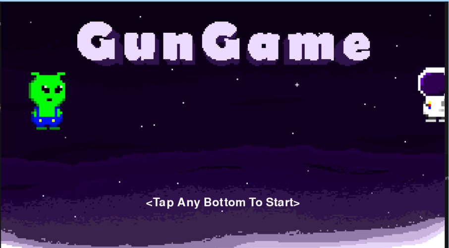

# GunGame


**GunGame** is a multiplayer competitive game developed using Python and Pygame. Players control characters to jump, shoot, throw bombs, and collect weapons and items to gain an advantage and defeat their opponents.

## Features

- **Multiplayer Competition:** Supports two players on the same device.
- **Diverse Weaponry:** Includes pistols, shotguns, sniper rifles, and more, each with unique speed, recoil, and ammo capacity.
- **Item System:** Features speed boosts, shields, and treasure boxes for strategic gameplay.
- **Dynamic Environment:** Includes fog effects, fireballs, and other dynamic elements for added challenges.

## System Requirements

- **Python Version:** 3.7 or higher
- **Pygame Version:** 2.0 or higher
- **Operating System:** Windows, macOS, or Linux

## Installation and Execution

1. **Clone or Download the Repository:**
   ```bash
   git clone https://github.com/your-repo/GunGame.git
   cd GunGame
   ```

2. **Install Dependencies:**
   Ensure Python is installed, then use the following command:
   ```bash
   pip install pygame
   ```

3. **Run the Game:**
   ```bash
   python final_project_GunGame.py
   ```

## Controls

### Player 1
- **Move:** `A` (left) / `D` (right)
- **Jump:** `W`
- **Move Down:** `S`
- **Shoot:** `V`
- **Throw Bomb:** `B`

### Player 2
- **Move:** `Left Arrow` (left) / `Right Arrow` (right)
- **Jump:** `Up Arrow`
- **Move Down:** `Down Arrow`
- **Shoot:** `K`
- **Throw Bomb:** `L`

## Resources

- Place all visual and audio resources in the same directory as the script, including:
  - Background music: `background_music.mp3`
  - Sound effects: `hit_sound.wav`, `fire.wav`, `bomb.wav`
  - Images: Characters, weapons, bombs, and item sprites.

## Developer Guide

### File Structure

- **`final_project_GunGame.py`**: The main script containing game logic, character controls, and scene rendering.
- **Resource Folder:** Stores the required images and sound effects.

### Extending the Game

1. Add more weapons or items.
2. Implement single-player or online multiplayer modes.
3. Expand maps and introduce challenge levels.

## Contact

For questions or suggestions, contact the developer at [your email or contact information].


