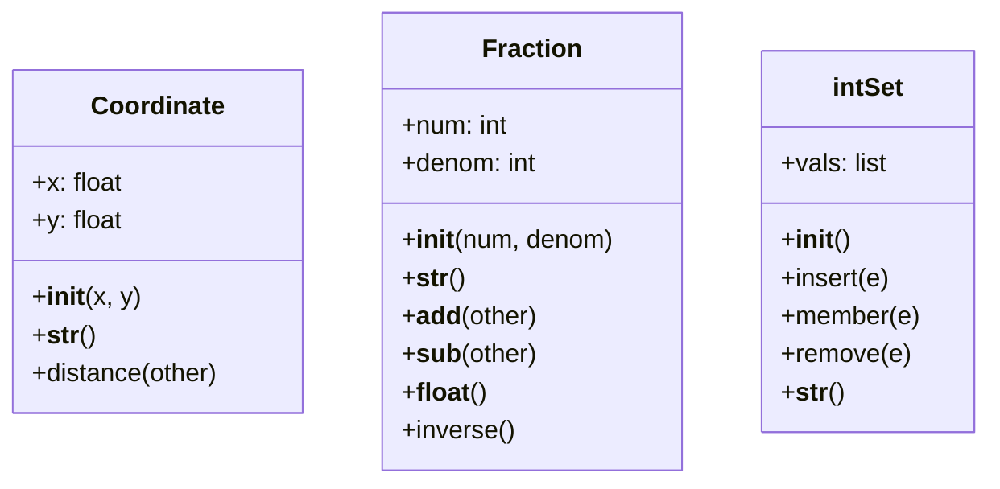

```mermaid
classDiagram
    class Coordinate {
        +x: float
        +y: float
        +__init__(x, y)
        +__str__()
        +distance(other)
    }

    class Fraction {
        +num: int
        +denom: int
        +__init__(num, denom)
        +__str__()
        +__add__(other)
        +__sub__(other)
        +__float__()
        +inverse()
    }

    class intSet {
        +vals: list
        +__init__()
        +insert(e)
        +member(e)
        +remove(e)
        +__str__()
    }
```
