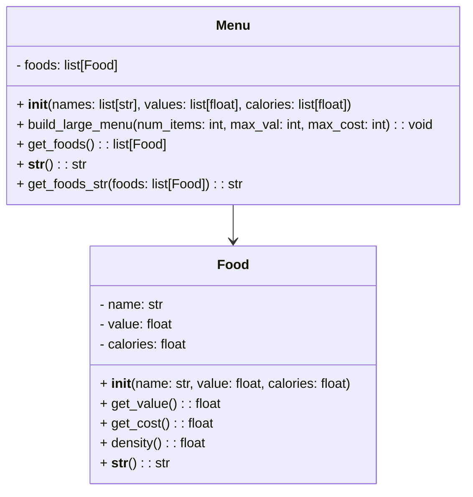

```mermaid
classDiagram
    class Food {
        - name: str
        - value: float
        - calories: float
        + __init__(name: str, value: float, calories: float)
        + get_value(): float
        + get_cost(): float
        + density(): float
        + __str__(): str
    }

    class Menu {
        - foods: list[Food]
        + __init__(names: list[str], values: list[float], calories: list[float])
        + build_large_menu(num_items: int, max_val: int, max_cost: int): void
        + get_foods(): list[Food]
        + __str__(): str
        + get_foods_str(foods: list[Food]): str
    }

    Menu "" --> "" Food
```