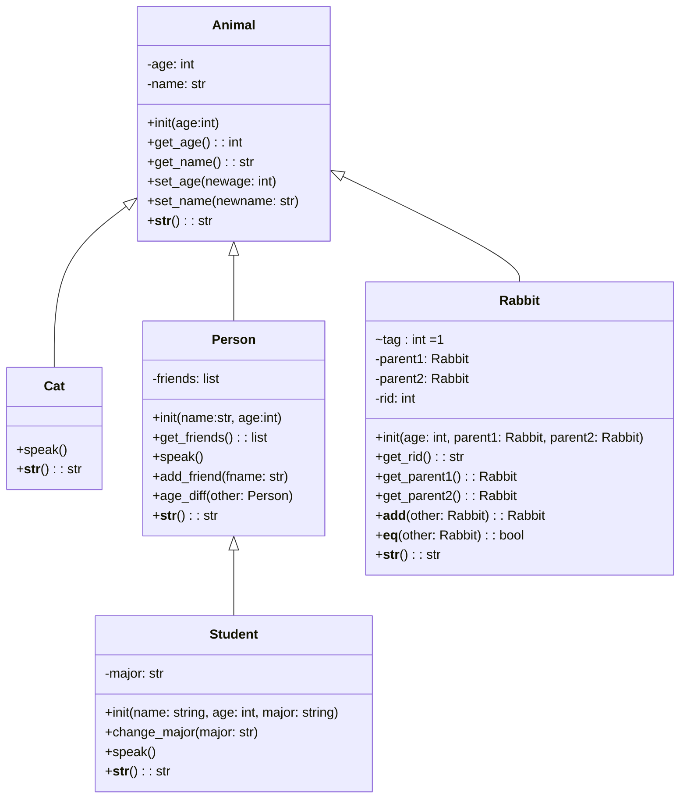

```mermaid
classDiagram
    class Animal {
        -age: int
        -name: str
        +init(age:int)
        +get_age(): int
        +get_name(): str
        +set_age(newage: int)
        +set_name(newname: str)
        +__str__(): str
    }

    class Cat {
        +speak()
        +__str__(): str
    }

    class Person {
        -friends: list
        +init(name:str, age:int)
        +get_friends(): list
        +speak()
        +add_friend(fname: str)
        +age_diff(other: Person)
        +__str__(): str
    }

    class Student {
        -major: str
        +init(name: string, age: int, major: string)
        +change_major(major: str)
        +speak()
        +__str__(): str
    }

    class Rabbit {
        ~tag : int =1
        -parent1: Rabbit
        -parent2: Rabbit
        -rid: int
        +init(age: int, parent1: Rabbit, parent2: Rabbit)
        +get_rid(): str
        +get_parent1(): Rabbit
        +get_parent2(): Rabbit
        +__add__(other: Rabbit): Rabbit
        +__eq__(other: Rabbit): bool
        +__str__(): str
    }

    Animal <|-- Cat
    Animal <|-- Person
    Person <|-- Student
    Animal <|-- Rabbit
```