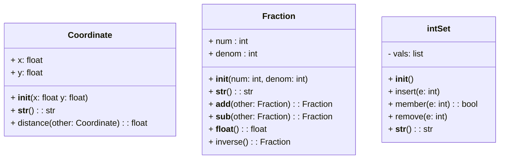

```mermaid
classDiagram
    class Coordinate {
        + x: float
        + y: float
        + __init__(x: float y: float)
        + __str__(): str
        + distance(other: Coordinate): float
    }

    class Fraction {
        + num : int
        + denom : int
        + __init__(num: int, denom: int)
        + __str__(): str
        + __add__(other: Fraction): Fraction
        + __sub__(other: Fraction): Fraction
        + __float__(): float
        + inverse(): Fraction
    }

    class intSet {
        - vals: list
        + __init__()
        + insert(e: int)
        + member(e: int): bool
        + remove(e: int)
        + __str__(): str
    }
```    

