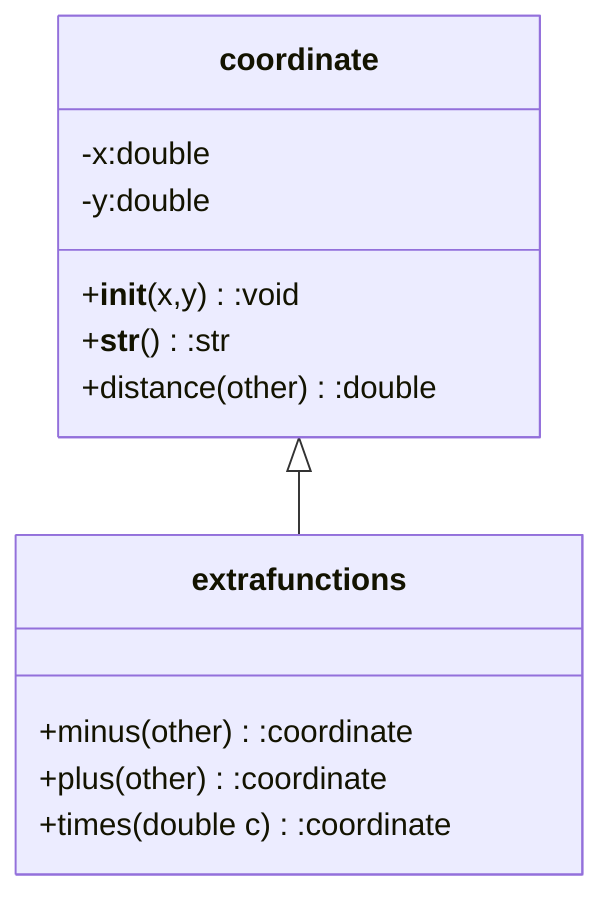

# add mermaid cladd diagram for class coordinate

```mermaid
classDiagram
    class coordinate{
        -x:double
        -y:double
        +__init__(x,y):void
        +__str__():str
        +distance(other):double
    }

    class extrafunctions{
        +minus(other):coordinate
        +plus(other):coordinate
        +times(double c):coordinate
    }

coordinate <|-- extrafunctions
```
