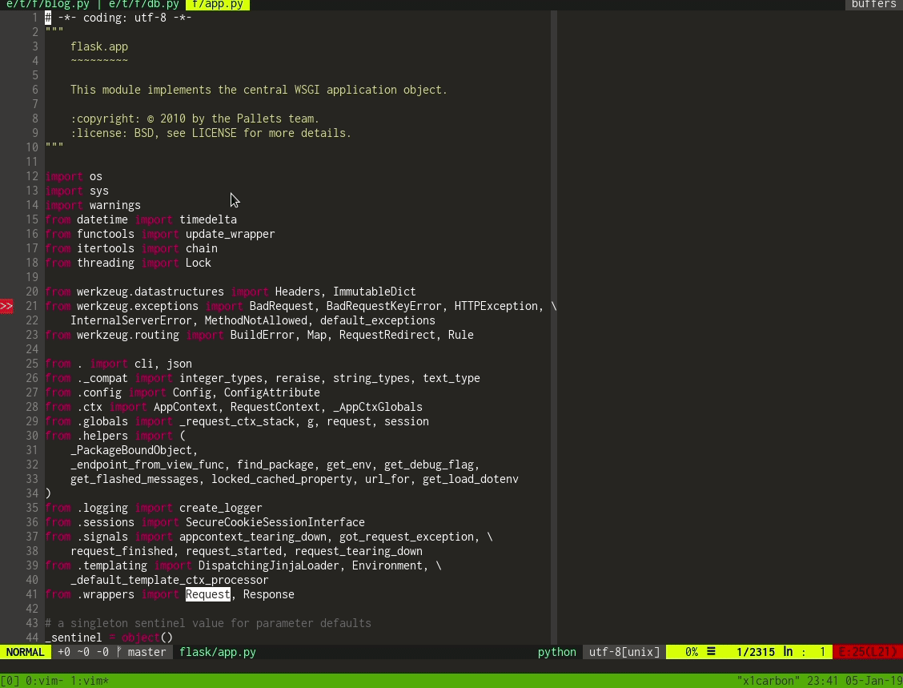
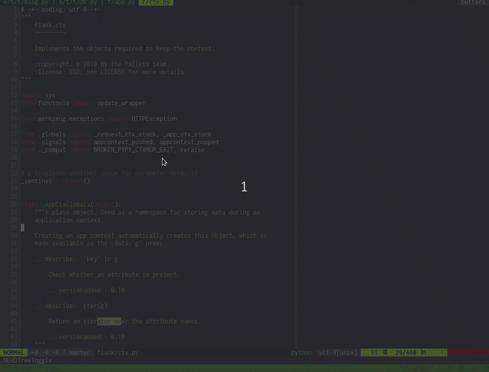
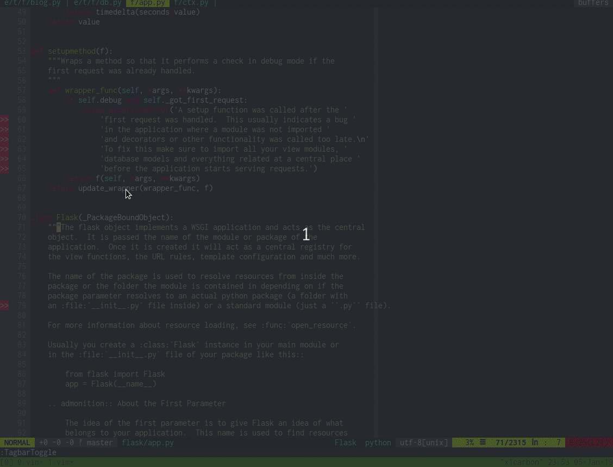
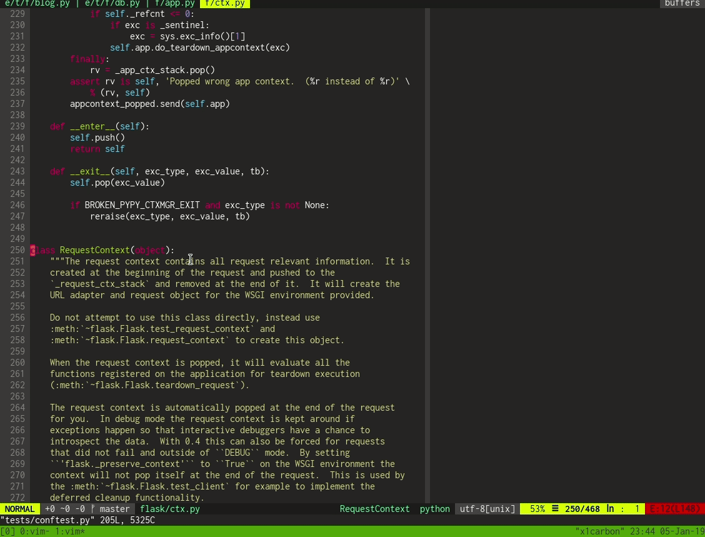

# Contents

This project aims to use Vim as a powerful and complete Python IDE. In order
to do that, we curated a list of awesome plugins available in the community and
provided an automatic installation procedure for this set.


<!-- ## Installation -->


<!-- ### Requirements for Ubuntu distros (Tested on Windows Subsystem for Linux)

Ubuntu 20.04

The following packages are excluded from Ubuntu 20.04. We do not seem to need them.
* libgnome2-dev libgnomeui-dev libbonoboui2-dev 
* This will also install python2 (python-dev)

```bash
sudo apt install libncurses5-dev \
libgtk2.0-dev libatk1.0-dev \
libcairo2-dev libx11-dev libxpm-dev libxt-dev python-dev \
python3-dev git ctags
```

Ubuntu 18.04

```bash
sudo apt install libncurses5-dev libgnome2-dev libgnomeui-dev \
libgtk2.0-dev libatk1.0-dev libbonoboui2-dev \
libcairo2-dev libx11-dev libxpm-dev libxt-dev python-dev \
python3-dev git ctags
```


### Installation process

```bash
git clone git@github.com:ARG-NCTU/vim-python-ide.git && \
cd vim-python-ide && ./install.sh
```

It seems that plugin rope is causing some errors, just comment it out in ~/.vimrc
in line 5
```
 " Plug 'python-rope/ropevim' 
```

Here we also disable open NerdTree while open vim
in line 45
```
" autocmd VimEnter * NERDTree
```

Add the following to the last line of ~/.vimrc to allow <F9> to save and run code
```
autocmd vimEnter *.py nmap <F9> <Esc>:w<CR>:!clear;python %<CR>                 
autocmd vimEnter *.cpp map <F9> :w <CR> :!clear ; g++ --std=c++17 %; if [ -f a.out ]; then time ./a.out; rm a.out; fi <CR>
```

### Add vim-ros (Optional)

Make sure you have ROS installed, and Python3 could find it.
```
cd ~/.vim/plugged
git clone https://github.com/ARG-NCTU/vim-ros
```
Add or uncomment to ~/.vimrc
```
Plug 'ARG-NCTU/vim-ros'
``` -->

## Basic Usages in Vim

Check the [Cheat Sheet](https://vim.rtorr.com/).

Buffer vs. Window
* Window: we will have the file tree, code editor, and file structure (showing classes/functions/...)
* Buffer: while we open multiple files to edit 
* Move around between windows: Ctl ww
* Move around between tabs: Tab or Shift Tab

## Key bindings

| Action                   | Mode             | key binding     |
|--------------------------|------------------|-----------------|
| Toogle Nerdtree          | Normal           | `crtl + n`      |
| Toogle Tagbar            | Normal           | `f8`            |
| Run Python.              | Normal           | `f9`            |
| Switch Focus             | Normal           | `crtl + ww`     |
| Expand snippet           | Insert           |`tab`            |
|--------------------------|------------------|-----------------|
| Look for file            | Normal           | `crtl + p`      |
| Goto definition          | Normal           | `crtl + ]`      |
| Show docstring           | Normal           | `K`             |
| Extract method           | Normal/Visual    | `crlt + c r m`  |
| Auto complete            | Insert           | `crtl + space`  |


Run Python in normal mode
```
:!clear; python %
```

## Features

Please check the available features and the plugins that enable them.

### Syntax Highlighting

Syntax highlighting for several languages, besides Python.

Powered by:

 * [vim-polyglot](https://github.com/sheerun/vim-polyglot)

### Color Themes

Several popular color schemes:

 * Monokai
 * Gruvbox
 * Much more

Powered by:

 * [vim-colorschemes](https://github.com/flazz/vim-colorschemes)


### Project Navigation

Easily navigate your project using:

 * File tree explore (Nerdtree)
1. Ctl n to toggle the tree explorer
2. Use Ctl ww to switch windows
3. To close all:
```
:qa or :wqa
```
4. ~/.vimrc has set to toggle file tree by Ctl + n



 * Fuzzy finder based on the file names
1. Ctl + p, and search for your file to open and hit Enter. This will open it in "buffer"
2. You could switch between buffers by Tab or Shift + Tab
3. It appears that you could start it in your project folder



 * File structure (classes, functions, methods).
1. You could press <F8> to show the file structure.
2. Use Ctl ww to set focus on window Tagbar. You could move the function/class for a quick navigation




Powered by:

 * [Nerdtree](https://github.com/scrooloose/nerdtree)
 * [Fzf](https://github.com/junegunn/fzf.vim)
 * [Tagbar](https://github.com/preservim/tagbar)

### Powerfull Full Text search

 * Full text search based on both exact match and fuzzy finder capabilities
 * Extremely fast.


Powered by:

 * [Ripgrep](https://github.com/BurntSushi/ripgrep)
 * [Fzf](https://github.com/junegunn/fzf.vim)

### Real time linting

Lint source files in real time an check for errors and warnings.

Powered by:

 * [Ale](https://github.com/w0rp/ale)

### Code navigation

* Go to function definitions
* Check parameters and docstrings easily.

Powered by:

* [vim-gutentags](https://github.com/ludovicchabant/vim-gutentags)
* [jedi-vim](https://github.com/davidhalter/jedi-vim)

### Code refactoring

Extract methods, variables and rename functions easily.

Powered by:

 * [jedi-vim](https://github.com/davidhalter/jedi-vim)
 * [rope-vim](https://github.com/python-rope/ropevim)

### Code completion

Use hints and dialog boxes to speed your development using code completion.

Powered by:

 * [jedi-vim](https://github.com/davidhalter/jedi-vim)

### Snippets

Snippets save time while you type and creates standardization for your code.

Powered by:

 * [vim-snippets](https://github.com/honza/vim-snippets)
 * [ultisnips](https://github.com/SirVer/ultisnips)

### Git Integration

Perform git operations and highlight changes in the repo.

Powered by:

 * [vim-fugitive](https://github.com/tpope/vim-fugitive)
 * [vim-gitgutter](https://github.com/airblade/vim-gitgutter)


## Commands

| Command Description            | Command        |
|--------------------------------|----------------|
| Look for string                | `:Rg <string>` |
| git status                     | `:Gstatus`     |
| git diff                       | `:Gdiff`        |
